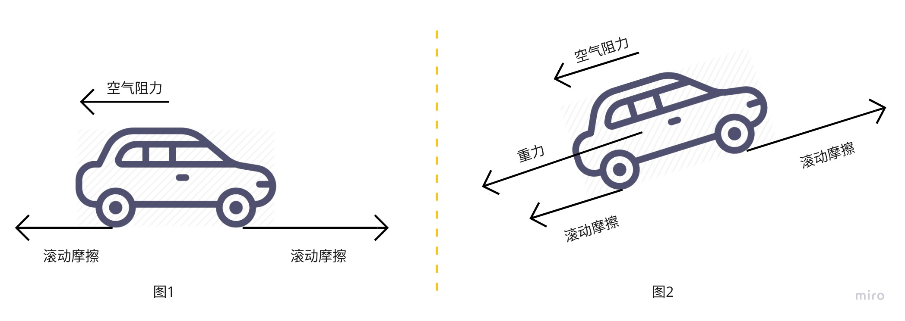

# Dig into Apollo - Control 

## Table of Contents
- [介绍](#introduce)

  

<a name="introduce" />

自动驾驶的控制模块逻辑相对比较简单，目前apollo采用的控制方法主要有2种：PID控制和MPC控制。
其中校正表的生成主要是通过实际测试过程中运行软件，并且得到速度-加速度/油门刹车之间的关系，这里说明下为什么需要速度加速度和油门刹车的关系，根据高中物理知识，当知道一个物体的速度和加速度信息，就可以知道当前物体一段时间后的位置。这个参照表也就是通过速度，加速度和油门之间的关系，得到一些表格，相当于是建立了速度，加速度和油门刹车之间的模型。最后通过查表的方式来实现控制汽车到指定的位置。  

首先这个表的生成需要测试每种油门以及每种速度下的表现，但是表不可能列出无限种数据，因此最后还是需要通过插值的方式来得到最后的结果。

## 模型
汽车前后方向的受力可以通过如下2幅图来表示：
  
汽车的前后受力很简单，如果是前轮驱动，那么前轮提供一个向前的滚动摩擦，后轮有一个滚动摩擦阻力再加上风阻，如果有坡度则再加上重力分量，这就构成了汽车的前后受力模型。

## 控制
控制采用了PID算法，因为需要汽车在指定的时间到达指定的地点，因此首先是保证位置准确，如果能够直接通过油门去控制汽车的位置，那么采用单一的环就够了，重点是位置是和速度与时间相关的，因此通过控制信息发送给速度，然后再通过速度的PID进行调节，这样的方式叫做级联控制器。通过2级PID来控制汽车的速度，从而确定需要踩多少的油门，在现在自动驾驶普遍是电动汽车的情况下，汽车的动力实际上由内燃机换成了电动马达，这种控制方式完全可以由伺服控制来解决，其中伺服控制器实现了位置控制，速度控制，可以把汽车的控制模块直接由伺服控制器来替代（不知道现在机器人的驱动是用马达的控制器是否是步进电机控制器还是伺服控制器，如果可以把方案搬到汽车上，也许可以解放汽车的控制）。汽车有个缺点是在速度很低的情况下位置后退需要换倒车档。

知道速度，加速度和时间，那么就可以计算出当前汽车行驶的距离，因此我们只需要找到速度，加速度和油门的关系，即可以根据当前的速度和需要的加速度来得到输出多大油门，当然也可以随便输入一个值，然后去调整整个值的大小（如果油门和力是呈现简单的线性关系的情况下）。

下面是百度文档中关于速度，加速度和油门关系的曲线，如果是线性的电机，那么其实很好办，油门可以直接对应为电机的电流，而电流对应电机输出的扭矩大小。
  

什么样的PID参数比较合适？这一部分可以参考WIKI百科的PID参数动画，有很长一段时间我都是在调试PID参数，但是在没有理解原理之前，只能是不断的尝试。
  

## 问题
1. 遇到上坡\下坡的情况，原来的系数表就只能提供一个参考，如何提供补偿，PID的每次输入都是从表中查询还是根据调节的结果来的？
2. 遇到下雨的时候，路面的摩擦系数改变和上述问题一样
3. 遇到长下坡，PID调节是否会和人一样“不能长时间踩脚踏板”
4. 转弯的场景是否适合这个参数？
5. 是否所有的场景都适合这个参数？比如自主泊车的情况？
6. 提供的是TrajectoryPoint，里面包含距离，速度，加速度和时间，这3者只要知道2者即可以了。控制的时候如何选择的颗粒度？比如提供的轨迹的时间间隔是否固定，是否每次都需要control模块自己调节（在时间间隔比较长的情况下），PID每次只能参考一个标准，这里是以距离为准，还是已速度为准？如果是，速度还有何意义？planning生成的TrajectoryPoint是否符合物理学规律？

## Reference
[Apollo代码学习(一)—控制模块概述](https://blog.csdn.net/u013914471/article/details/82775091)  
[百度Apollo 2.0 车辆控制算法之LQR控制算法解读](https://blog.csdn.net/weijimin1/article/details/85794084)  
[Apollo代码学习(五)—横纵向控制](https://blog.csdn.net/u013914471/article/details/83748571)  
[Apollo自动驾驶入门课程第⑩讲 — 控制（下）](https://blog.csdn.net/cg129054036/article/details/83413482)  
[how_to_tune_control_parameters](https://github.com/ApolloAuto/apollo/blob/master/docs/howto/how_to_tune_control_parameters.md)  
[throttle-affect-the-rpm-of-an-engine](https://www.physicsforums.com/threads/how-does-the-throttle-affect-the-rpm-of-an-engine.832029/)  
[PID_controller](https://en.wikipedia.org/wiki/PID_controller)  

https://www.mathworks.com/help/mpc/ug/adaptive-cruise-control-using-model-predictive-controller.html  
http://ctms.engin.umich.edu/CTMS/index.php?example=CruiseControl&section=SystemModeling  
https://www.mathworks.com/help/physmod/sdl/ug/about-the-complete-vehicle-model.html  
https://www.mathworks.com/help/physmod/sdl/ug/control-vehicle-throttle-input-using-a-powertrain-blockset-driver.html  

