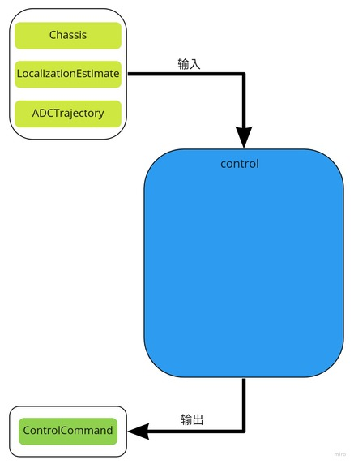
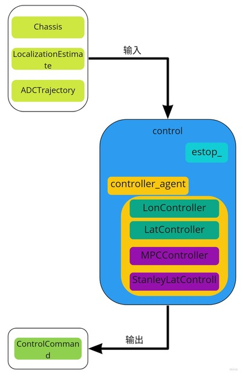
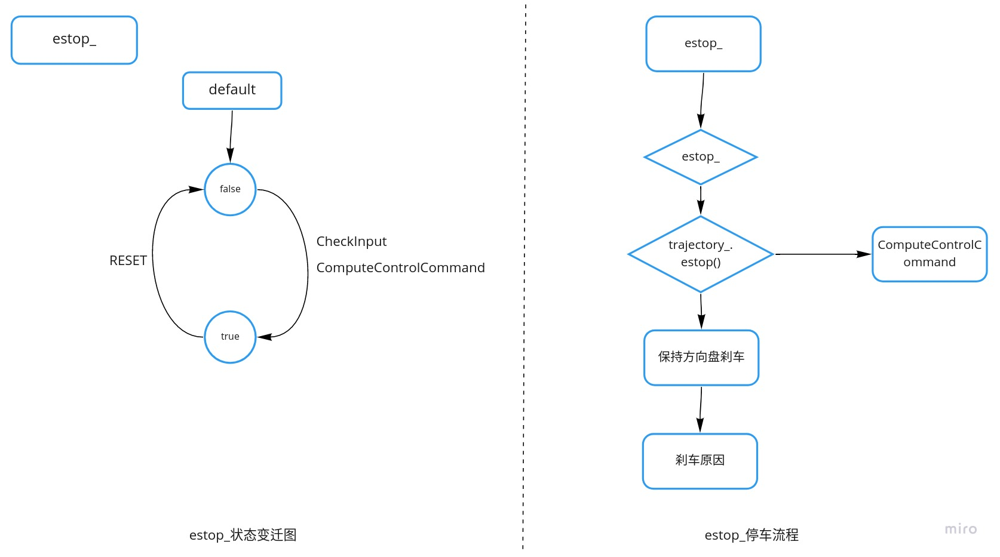

# Dig into Apollo - Control 

## Table of Contents
- [Control模块简介](#introduction)

  

<a name="introduction" />

## Control模块简介
Apollo控制模块的逻辑相对比较简单，控制模块的作用主要是**根据规划(planning)模块生成的轨迹，计算出汽车能够识别的油门，刹车和方向盘信号，控制汽车按照规定的轨迹行驶**。主要是根据汽车动力和运动学的知识，对汽车进行建模，实现对汽车的控制。目前apollo主要用到了2种控制方式：PID控制和模型控制。   
 
首先我们需要搞清楚control模块的输入是什么，输出是什么？
  
可以看到control模块：
* **输入** - Chassis(车辆状态信息), LocalizationEstimate(位置信息), ADCTrajectory(planning模块规划的轨迹)
* **输出** - ControlCommand(油门，刹车，方向盘)

Control模块的目录结构如下：  
```
├── BUILD      // bazel编译文件
├── common     // PID和控制器的具体实现     --- 算法具体实现
├── conf       // 配置文件                 --- 配置文件
├── control_component.cc  // 模块入口
├── control_component.h   
├── control_component_test.cc
├── controller           // 控制器         --- 具体的控制器实现
├── dag                  // dag依赖
├── integration_tests    // 测试
├── launch               // launch加载
├── proto                // protobuf文件，主要各个控制器的配置数据结构
├── testdata             // 测试数据
└── tools                // 根据类
```

下面我们来分析下control模块的执行流程。

## Control主流程
Control模块的入口在"control_component.cc"中，和其他的模块一样，Control模块注册为一个cyber的模块，其中control模块为定时模块，也就是每隔10ms执行一次命令。这里需要注意了planning模块的输出是100ms一次，也就是说100ms才给出一条曲线，而control模块会根据这条曲线，每10ms处理一次，控制汽车按照指定的速度到达指定的位置。  
Control模块执行的主函数是"ControlComponent::Proc()"即每10ms调用一次该函数，处理的流程在该函数中：  
```c++
bool ControlComponent::Proc() {
  // 1. 读取输入数据，通过拷贝读取输入信息
  chassis_reader_->Observe();
  const auto &chassis_msg = chassis_reader_->GetLatestObserved();
  if (chassis_msg == nullptr) {
    AERROR << "Chassis msg is not ready!";
    return false;
  }

  OnChassis(chassis_msg);

  ...
  const auto &trajectory_msg = trajectory_reader_->GetLatestObserved();

  ...
  const auto &localization_msg = localization_reader_->GetLatestObserved();


  ControlCommand control_command;
  // 2. 生成控制命令
  Status status = ProduceControlCommand(&control_command);

  ...

  common::util::FillHeader(node_->Name(), &control_command);
  // 3. 发送控制命令
  control_cmd_writer_->Write(std::make_shared<ControlCommand>(control_command));

  return true;
}
```
上述的流程大概分为3个部分：
1. **读取输入数据**
2. **生成控制命令**
3. **发送控制命令**  

生成控制命令的核心函数在"ProduceControlCommand"中，其实这个函数中包含了参数检查和_estop(紧急情况)的处理，真正生成命令的函数只有一行:  
```c++
    Status status_compute = controller_agent_.ComputeControlCommand(
        &local_view_.localization, &local_view_.chassis,
        &local_view_.trajectory, control_command);
```

#### 控制器注册
最后通过"controller_agent_"产生控制命令，而"controller_agent_"是一个代理控制器，由于有多个控制器，其他的控制器通过注册到代理控制器，来实现多个控制器的调用：  
  
其中控制器包括：
* 纵向控制
* 横向控制
* 模型预测控制
* Stanley横向控制
> Stanley横向控制可以[参考](https://www.ri.cmu.edu/pub_files/2009/2/Automatic_Steering_Methods_for_Autonomous_Automobile_Path_Tracking.pdf)  

那么这些控制器是如何注册到"controller_agent_"的呢？  
```c++
// 1. 在ControlComponent::Init()中调用初始化
bool ControlComponent::Init() {
  // 注册控制器
  if (!controller_agent_.Init(&control_conf_).ok()) {
    monitor_logger_buffer_.ERROR("Control init controller failed! Stopping...");
    return false;
  }
}

// 2. 在ControllerAgent类中注册和初始化
Status ControllerAgent::Init(const ControlConf *control_conf) {
  // 注册控制器
  RegisterControllers(control_conf);
  // 实例化控制器
  CHECK(InitializeConf(control_conf).ok()) << "Fail to initialize config.";
  // 控制器初始化
  for (auto &controller : controller_list_) {
    if (controller == NULL || !controller->Init(control_conf_).ok()) {
      if (controller != NULL) {
        AERROR << "Controller <" << controller->Name() << "> init failed!";
        return Status(ErrorCode::CONTROL_INIT_ERROR,
                      "Failed to init Controller:" + controller->Name());
      } else {
        return Status(ErrorCode::CONTROL_INIT_ERROR,
                      "Failed to init Controller");
      }
    }
    AINFO << "Controller <" << controller->Name() << "> init done!";
  }
  return Status::OK();
}
```
上面就是control模块的主流程，我们接着介绍下control模块中的"pad message"和"estop_"，然后再介绍各个控制器的具体实现。  

#### Pad消息
Pad消息通过发送状态来控制control模块的模式，其中"DrivingAction"一共有3种状态，在"pad_msg.proto"中:
```
enum DrivingAction {
  STOP = 0;
  START = 1;
  RESET = 2;
};
```
在control模块中只能使用pad "RESET"来清空"estop_"的状态。实际上control模块会判断"driving_mode"来决定是否启动自动驾驶，而"driving_mode"是通过pad信息发送状态给"canbus"模块来控制的，这会在canbus模块分析中详细介绍。  
总之pad信息的2个作用是:  
1. **发送消息给canbus模块，来控制driving_mode，control模块判断当前driving_mode的状态来决定是否启动自动驾驶**
2. **通过reset来清空estop_的状态**

那么"estop_"有什么作用呢？  
#### estop_标志位
estop_标志位的作用是判断control模块是否处于紧急状态，而触发紧急停车。那么在哪些状态下，"estop_"为真，汽车进入紧急停车状态呢？  
1. 输入错误(CheckInput返回false)
2. 计算控制命令失败(ComputeControlCommand失败)
3. planning模块直接给出是否紧急停车   
下面是"estop_"的状态变迁图和紧急停车流程:  
  

紧急停车的流程很好理解，我们学驾照的时候都知道，紧急停车的时候不能够狂打方向盘，特别是高速的时候，容易侧翻，因此这里的紧急停车流程也是保持方向盘，然后紧急制动。  

## 控制器


其中校正表的生成主要是通过实际测试过程中运行软件，并且得到速度-加速度/油门刹车之间的关系，这里说明下为什么需要速度加速度和油门刹车的关系，根据高中物理知识，当知道一个物体的速度和加速度信息，就可以知道当前物体一段时间后的位置。这个参照表也就是通过速度，加速度和油门之间的关系，得到一些表格，相当于是建立了速度，加速度和油门刹车之间的模型。最后通过查表的方式来实现控制汽车到指定的位置。  

首先这个表的生成需要测试每种油门以及每种速度下的表现，但是表不可能列出无限种数据，因此最后还是需要通过插值的方式来得到最后的结果。

control模块的输入是 车身信息，位置信息，以及规划的轨迹，输出是控制命令(方向盘，油门，刹车)。


ControllerAgent 作为控制器的代理(是否为设计模式的代理模式)，注册了3种控制器：LonController, LatController, MPCController （StanleyLatController这个是什么作用？？？）这3个控制器都继承来自Controller的基础类。

proto主要是一些配置文件的定义。


下面分别介绍几个控制器：
LonController
LatController
MPCController


另外一个比较关注的地方在于"estop_"，即在紧急情况下，control模块应该有自己处理汽车当前状况的能力。而什么是紧急状况，紧急状况的定义是什么呢？首先的一点就是规划命令有3秒没有下发（是否一定要触发停车？），或者一些紧急情况，需要立刻停车的场景。

另外关于PID控制的时候，正常情况下是没有问题，如果是遇到路面不平的情况，相当于人为的给小车一个推力，这样就对PID的反馈引入了一个震荡，震荡的引入之后系统是否能够保持收敛或者稳态呢，这就是PID控制需要研究的范围？？？

## 模型
汽车前后方向的受力可以通过如下2幅图来表示：
  
汽车的前后受力很简单，如果是前轮驱动，那么前轮提供一个向前的滚动摩擦，后轮有一个滚动摩擦阻力再加上风阻，如果有坡度则再加上重力分量，这就构成了汽车的前后受力模型。


## 控制
控制采用了PID算法，因为需要汽车在指定的时间到达指定的地点，因此首先是保证位置准确，如果能够直接通过油门去控制汽车的位置，那么采用单一的环就够了，重点是位置是和速度与时间相关的，因此通过控制信息发送给速度，然后再通过速度的PID进行调节，这样的方式叫做级联控制器。通过2级PID来控制汽车的速度，从而确定需要踩多少的油门，在现在自动驾驶普遍是电动汽车的情况下，汽车的动力实际上由内燃机换成了电动马达，这种控制方式完全可以由伺服控制来解决，其中伺服控制器实现了位置控制，速度控制，可以把汽车的控制模块直接由伺服控制器来替代（不知道现在机器人的驱动是用马达的控制器是否是步进电机控制器还是伺服控制器，如果可以把方案搬到汽车上，也许可以解放汽车的控制）。汽车有个缺点是在速度很低的情况下位置后退需要换倒车档。

知道速度，加速度和时间，那么就可以计算出当前汽车行驶的距离，因此我们只需要找到速度，加速度和油门的关系，即可以根据当前的速度和需要的加速度来得到输出多大油门，当然也可以随便输入一个值，然后去调整整个值的大小（如果油门和力是呈现简单的线性关系的情况下）。

下面是百度文档中关于速度，加速度和油门关系的曲线，如果是线性的电机，那么其实很好办，油门可以直接对应为电机的电流，而电流对应电机输出的扭矩大小。
  

什么样的PID参数比较合适？这一部分可以参考WIKI百科的PID参数动画，有很长一段时间我都是在调试PID参数，但是在没有理解原理之前，只能是不断的尝试。
  


纵向控制主要是控制速度，而横向控制主要是控制路径，即在方向盘转角一定的情况下，汽车行驶的路径是固定的，速度的快慢只是影响汽车行驶的时间，纵向控制在转弯时候的受力模型有改变吗？？？

## 问题
1. 遇到上坡\下坡的情况，原来的系数表就只能提供一个参考，如何提供补偿，PID的每次输入都是从表中查询还是根据调节的结果来的？
2. 遇到下雨的时候，路面的摩擦系数改变和上述问题一样
3. 遇到长下坡，PID调节是否会和人一样“不能长时间踩脚踏板”
4. 转弯的场景是否适合这个参数？
5. 是否所有的场景都适合这个参数？比如自主泊车的情况？
6. 提供的是TrajectoryPoint，里面包含距离，速度，加速度和时间，这3者只要知道2者即可以了。控制的时候如何选择的颗粒度？比如提供的轨迹的时间间隔是否固定，是否每次都需要control模块自己调节（在时间间隔比较长的情况下），PID每次只能参考一个标准，这里是以距离为准，还是已速度为准？如果是，速度还有何意义？planning生成的TrajectoryPoint是否符合物理学规律？


## Reference
[Apollo代码学习(一)—控制模块概述](https://blog.csdn.net/u013914471/article/details/82775091)  
[百度Apollo 2.0 车辆控制算法之LQR控制算法解读](https://blog.csdn.net/weijimin1/article/details/85794084)  
[Apollo代码学习(五)—横纵向控制](https://blog.csdn.net/u013914471/article/details/83748571)  
[Apollo自动驾驶入门课程第⑩讲 — 控制（下）](https://blog.csdn.net/cg129054036/article/details/83413482)  
[how_to_tune_control_parameters](https://github.com/ApolloAuto/apollo/blob/master/docs/howto/how_to_tune_control_parameters.md)  
[throttle-affect-the-rpm-of-an-engine](https://www.physicsforums.com/threads/how-does-the-throttle-affect-the-rpm-of-an-engine.832029/)  
[PID_controller](https://en.wikipedia.org/wiki/PID_controller)  
[Stanley横向控制](https://www.ri.cmu.edu/pub_files/2009/2/Automatic_Steering_Methods_for_Autonomous_Automobile_Path_Tracking.pdf)   


https://www.mathworks.com/help/mpc/ug/adaptive-cruise-control-using-model-predictive-controller.html  
http://ctms.engin.umich.edu/CTMS/index.php?example=CruiseControl&section=SystemModeling  
https://www.mathworks.com/help/physmod/sdl/ug/about-the-complete-vehicle-model.html  
https://www.mathworks.com/help/physmod/sdl/ug/control-vehicle-throttle-input-using-a-powertrain-blockset-driver.html  

