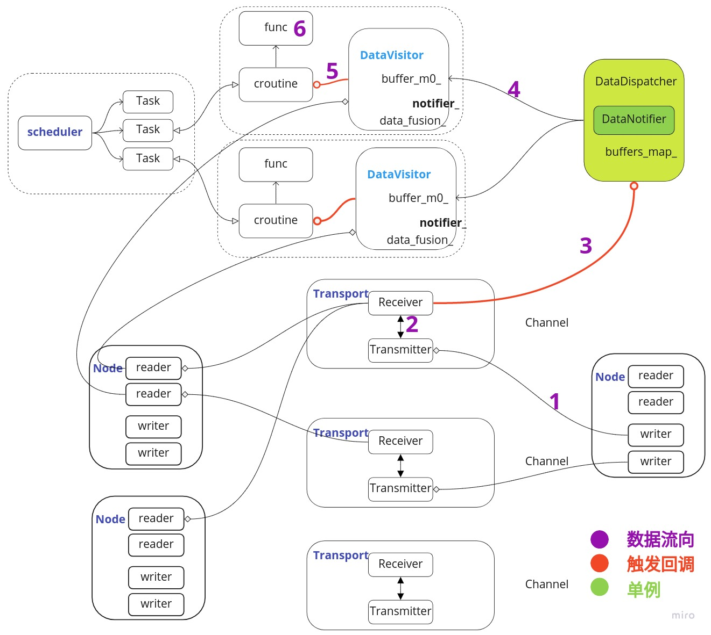

# Dig into Apollo - Cyber 

写在之前，之前的分析都是一些源码级别的分析，发现一开始就深入源码，很容易陷进去，特别是模块非常多的情况，需要看很多遍才能理解清楚。要写出更容易理解的文档，需要的不是事无巨细的分析代码，更主要的是能够把复杂的东西抽象出来，变为简单的东西。一个很简答的例子是画函数调用流程图很简单，但是要把流程图转换成框图却很难。  

## 数据处理流程
我们先看下cyber中整个的数据处理流程，通过理解数据流程中各个模块如何工作，来搞清楚每个模块的作用，然后我们再接着分析具体的模块。    
  

如上图所示，cyber的数据流程可以分为6个过程。  
1. Node节点中的Writer往通道里面写数据。
2. 通道中的Transmitter发布消息，通道中的Receiver订阅消息。
3. Receiver接收到消息之后，触发回调，触发DataDispather进行消息分发。
4. DataDispather接收到消息后，把消息放入CacheBuffer，并且触发Notifier，通知对应的DataVisitor处理消息。
5. DataVisitor把数据从CacheBuffer中读出，并且进行融合，然后通过notifier_唤醒对应的协程。
6. 协程执行对应的注册回调函数，进行数据处理，处理完成之后接着进入睡眠状态。

对数据流程有整体的认识之后，下面我们在分析具体的每个模块，我们还是按照功能划分。  

## 整体介绍
首先我们对cyber中各个模块做一个简单的介绍，之后再接着分析。实际上我们只要搞清楚了下面一些概念之间的关系，就基本上理解清楚了整个Cyber的数据流程。     

#### 1.Component和Node的关系
Component是cyber中封装好的数据处理流程，对用户来说，对应自动驾驶中的Planning Component, Perception Component等，目的是帮助我们更方便的订阅和处理消息。实际上Component模块在加载之后会执行"Initialize()"函数，这是个隐藏的初始化过程，对用户不可见。在"Initialize"中，Component会创建一个Node节点，概念上对应ROS的节点，**每个Component模块只能有一个Node节点**，也就是说每个Component模块有且只能有一个节点，在Node节点中进行消息订阅和发布。  

#### 2.Node和Reader\Writer的关系
在Node节点中可以创建Reader订阅消息，也可以创建Writer发布消息，每个Node节点中可以创建多个Reader和Writer。  

#### 3.Reader和Receiver,Writer和Transmitter,Channel的关系
一个Channel对应一个Topic，概念上对应ROS的消息通道，每个Topic都是唯一的。而Channel中包括一个发送器(Transmitter)和接收器(Receiver)，通过Receiver接收消息，通过Transmitter发送消息。  
一个Reader只能订阅一个通道的消息，如果一个Node需要订阅多个通道的消息，需要创建多个Reader。同理一个Writer也只能发布一个通道的消息，如果需要发布多个消息，需要创建多个Writer。Reader中调用Receiver订阅消息，而Writer通过Transmitter发布消息。 

#### 4.Receiver, DataDispather和DataVisitor的关系
每一个Receiver接收到消息之后，都会触发回调，回调中触发DataDispather（消息分发器）发布消息，DataDispather是一个单例，所有的数据分发都在数据分发器中进行，DataDispather会把数据放到对应的缓存中，然后Notify(通知)对应的模块去处理消息。  
DataVisitor（消息访问器）是一个辅助的类，**每一个Reader创建的时候对应一个DataVisitor，通过在DataVisitor中注册Notify（通知），注册对应的Buffer，和对应的数据处理回调函数**，这样在DataDispather的时候会通知对应的DataVisitor去处理回调函数。  
也就是说DataDispather（消息分发器）发布对应的消息到DataVisitor，DataVisitor（消息访问器）通过回调函数处理消息。每个Reader初始化的时候创建一个DataVisitor，并且注册回调函数。  

#### 5.DataVisitor和Croutine的关系
实际上DataVisitor中的Notify是通过唤醒协程（为了方便理解也可以理解为线程，可以理解为你有一个线程池，通过线程池绑定数据处理函数，数据到来之后就唤醒对应的线程去执行任务），每个协程绑定了一个数据处理函数和一个DataVisitor，数据到达之后，通过DataVisitor中的Notify唤醒对应的协程，执行数据处理回调，执行完成之后协程进入休眠状态。  

#### 6.Scheduler, Task和Croutine
通过上述分析，**数据处理的过程实际上就是通过协程完成的，每一个协程被称为一个Task，所有的Task(任务)都由Scheduler进行调度**。从这里我们可以分析得出实际上Cyber的实时调度由协程去保障，并且可以灵活的通过协程去设置对应的调度策略，当然协程依赖于进程，Apollo在linux中设置进程的优先级为实时轮转，先保障进程的优先级最高，然后内部再通过协程实现对应的调度策略。  
协程和线程的优缺点这里就不展开了，这里有一个疑问是协程不能被终止，除非协程主动退出，这里先留一个伏笔，后面我们再分析协程的调度问题。  

上述就是各个概念之间的关系，上述介绍对理解数据的流程非常有帮助，希望有时间的时候，大家可以画一下对应的数据流程图和关系。  

## TODO
以下为未完成部分，可以略过

## Component介绍

我们需要清楚一点，我们所有的操作都是在component中完成的，component中的执行流程很简单，先是订阅消息，然后通过算法处理消息，最后输出消息。  
其实component是cyber为了帮助我们特意实现的，系统在创建component的时候会自动帮我们创建一个node，通过node来订阅和发布对应的消息，每个component有且只能对应一个node。  
以planning模块为例，实际上只要按照系统提供的接口，我们就可以直接应用收到的消息了。  
'''
bool PlanningComponent::Proc(
    const std::shared_ptr<prediction::PredictionObstacles>&
        prediction_obstacles,
    const std::shared_ptr<canbus::Chassis>& chassis,
    const std::shared_ptr<localization::LocalizationEstimate>&
        localization_estimate) {
  ACHECK(prediction_obstacles != nullptr);

  // check and process possible rerouting request
  CheckRerouting();

  // process fused input data
  local_view_.prediction_obstacles = prediction_obstacles;
  local_view_.chassis = chassis;
  local_view_.localization_estimate = localization_estimate;
'''
上述过程实际上是component类在创建的时候通过node订阅的，不需要用户自己去实现，所以说，component类帮用户简化了发布和订阅的过程，能够更加专注于处理算法逻辑部分。  

#### component动态加载
component中每个模块都设计为可以动态加载和卸载，可以实时在线的关闭和开启模块，实现的方式是通过classloader来进行动态的加载component类。

## Node模块介绍
一个component只能唯一对应一个node，而每个node可以创建多个reader和writer，一个reader和writer绑定一个topic进行订阅和发布消息。

## reader和writer如何进行收发

## data_fusion_
data_fusion_总是以第一个消息为基准，查找融合最新的消息。

## Transport
Transport 把消息通过 DataDispatcher 把消息放进buffer 并且触发 DataNotifier::Notify

notify之后会触发 协程执行 而协程会调用DataVisitor::TryFetch 去取数据

取到数据之后，调用process函数执行。

## ListenerHandler 和 RtpsDispatcher
是否为通知signal接收发送消息，对应一张线性表？？？

RtpsDispatcher 用来分发消息，同时触发ListenerHandler？？？

## Croutine调度
什么时候采用协程，用协程做了哪些工作？？？

#### scheduler, task和croutine
如果有一个新的任务需要处理，则调度器会创建一个任务，而任务又由协程去处理。
创建任务的时候DataVisitorBase在调度器中注册回调，这个回调触发调度器根据任务id进行NotifyProcessor

一个任务就是一个协程，协程负责调用reader enqueue读取消息，平时处于yeild状态，等到DataVisitor触发回调之后开始工作。

