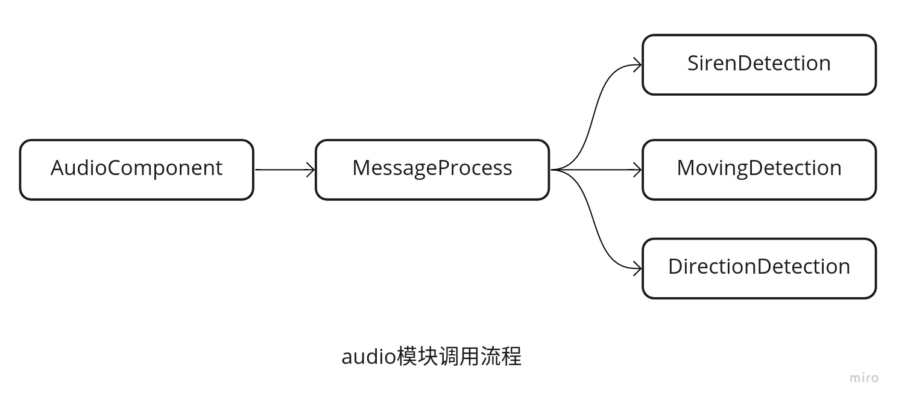

# Dig into Apollo - Audio 

> 勤学如春起之苗，不见其增，日有所长。


## Table of Contents
- [Audio模块介绍](#introduction)
  - [输入输出](#input_output)
- [目录结构](#content)
  - [模块入口](#main_process)
  - [消息处理（MessageProcess）](#message_process)
- [声音识别（SirenDetection）](#siren_detection)
- [移动检测(MovingDetection)](#moving_detection)
- [方向检测(DirectionDetection)](#direction_detection)
- [工具（tools）](#tools)


<a name="introduction" />

## Audio模块介绍
audio模块是6.0新增加的模块，主要的用途是通过声音来识别紧急车辆（警车，救护车，消防车）。目前的功能还相对比较简单，只能识别单个紧急车辆，同时需要环境风速低于20mph。下面我们会详细分析这个模块的原理以及实现。

<a name="input_output" />

#### 输入输出
audio模块的输入是`/apollo/sensor/microphone`，输入的消息来源于"drivers/microphone"，用到的硬件模块是"RESPEAKER"，目前有双通道和四通道，Apollo用到的硬件是四通道，关于硬件的相关介绍，会在"drivers/microphone"中进行说明。

audio模块的输出是`/apollo/audio_detection`，输出的消息包括，是否检测到紧急车辆，检测到紧急车辆的移动类型（接近还是远离），位置以及角度。

也就是说audio模块单纯的通过声音来识别有没有紧急车辆，以及紧急车辆的位置，为无人驾驶车的感知添加了新的维度。语音交互在车机智能里是非常好的交互方式，目前面临的主要难点主要是面临汽车里的噪音等的影响，这在通过声音感知汽车的时候尤其重要。

<a name="content" />

## 目录结构
audio模块的目录结构如下，整体来说并不复杂，主要的逻辑在"inference"中。  
```
├── audio_component.cc
├── audio_component.h   // 模块入口
├── BUILD
├── common
├── conf
├── dag
├── data            // 模型文件
├── inference       // 推理
├── launch
├── proto           // 消息格式
├── README.md
└── tools           // 工具
```

Audio模块为事件驱动，当接受到驱动模块的声音输入的时候，就开始解析声音，并且输出结果，下面我们来详细分析处理过程。
audio模块的整体调用流程如图：
  

<a name="main_process" />

#### 模块入口
audio模块通过"Init()"进行初始化，主要是读取录音机的外参，并且创建"audio_writer_"用于发布消息。初始化好之后，接着通过"Proc"来处理消息。处理的过程主要通过"OnMicrophone"来完成。  
```c++
bool AudioComponent::Proc(const std::shared_ptr<AudioData>& audio_data) {
  // TODO(all) remove GetSignals() multiple calls
  AudioDetection audio_detection;
  MessageProcess::OnMicrophone(*audio_data, respeaker_extrinsics_file_,
      &audio_info_, &direction_detection_, &moving_detection_,
      &siren_detection_, &audio_detection);

  FillHeader(node_->Name(), &audio_detection);
  audio_writer_->Write(audio_detection);
  return true;
}
```

<a name="message_process" />

#### 消息处理（MessageProcess）
MessageProcess类实际上是推理模块的一个集合，具体的任务实际上还是在"inference"目录中完成的，主要有3个类，分别为
* **SirenDetection** - 通过深度学习的方法，判断是否是紧急车辆声音。
* **MovingDetection** - 通过声音强度信息和多普勒效应，来判断车辆是靠近还是远离。
* **DirectionDetection** - 通过多个通道之间的差异，计算声音的方向。

下面我们开始分别介绍这3个功能。

<a name="siren_detection" />

## 声音识别（SirenDetection）
声音识别SirenDetection类中只有2个函数, LoadModel主要是进行模型的加载，模型在"audio/data"目录。
```c++
class SirenDetection {
 public:
  bool Evaluate(const std::vector<std::vector<double>>& signals);

 private:
  void LoadModel();
```

Evaluate函数对多个通道进行归一化，之后直接输入模型，并且得出正向和反向的结果，当正向的分数大于反向的时候，则表示检测到了特殊车辆。  
```c++
bool SirenDetection::Evaluate(const std::vector<std::vector<double>>& signals) {
  // 1. 读取4个通道的数据，装入audio_tensor中
  torch::Tensor audio_tensor = torch::empty(4 * 1 * 72000);
  float* data = audio_tensor.data_ptr<float>();
  
  for (const auto& channel : signals) {
    for (const auto& i : channel) {
      *data++ = static_cast<float>(i) / 32767.0;
    }
  }

  // 2. 转换声音为张量
  torch::Tensor torch_input = torch::from_blob(audio_tensor.data_ptr<float>(),
                                               {4, 1, 72000});
  std::vector<torch::jit::IValue> torch_inputs;
  torch_inputs.push_back(torch_input.to(device_));

  // 3. 模型推理
  at::Tensor torch_output_tensor = torch_model_.forward(torch_inputs).toTensor()
                                               .to(torch::kCPU);
  auto torch_output = torch_output_tensor.accessor<float, 2>();

  // 4. 投票表决
  float neg_score = torch_output[0][0] + torch_output[1][0] +
                    torch_output[2][0] + torch_output[3][0];
  float pos_score = torch_output[0][1] + torch_output[1][1] +
                    torch_output[2][1] + torch_output[3][1];

  if (neg_score < pos_score) {
    return true;
  } else {
    return false;
  }
}
```

<a name="moving_detection" />

## 移动检测(MovingDetection)
移动检测在"MovingDetection"类中实现，通过检测通过3帧的声音强度和声音频率，来判断紧急车辆是接近还是远离。MovingDetection中主要有3个函数。
```c++
  // 1. 快速傅里叶变换
  std::vector<std::complex<double>> fft1d(const std::vector<double>& signals);
  // 2. 移动检测
  MovingResult Detect(const std::vector<std::vector<double>>& signals);
  // 3. 检测单个通道
  MovingResult DetectSingleChannel(
      const std::size_t channel_index, const std::vector<double>& signal);
```

快速傅里叶变换在fft1d中完成，主要是把时域的东西转换到频域，在这里主要是得到声音的频率。

接下来我们主要看"DetectSingleChannel"的实现。
```c++
MovingResult MovingDetection::DetectSingleChannel(
    const std::size_t channel_index, const std::vector<double>& signals) {
  static constexpr int kStartFrequency = 3;
  static constexpr int kFrameNumStored = 10;
  std::vector<std::complex<double>> fft_results = fft1d(signals);
  // 1. 获取声音信息
  SignalStat signal_stat = GetSignalStat(fft_results, kStartFrequency);
  signal_stats_[channel_index].push_back(signal_stat);
  while (static_cast<int>(signal_stats_[channel_index].size()) >
         kFrameNumStored) {
    signal_stats_[channel_index].pop_front();
  }
  // 2. 分析声音强度
  MovingResult power_result = AnalyzePower(signal_stats_[channel_index]);
  if (power_result != UNKNOWN) {
    return power_result;
  }
  // 3. 分析声音频率
  MovingResult top_frequency_result =
      AnalyzeTopFrequence(signal_stats_[channel_index]);
  return top_frequency_result;
}
```
可以看到单个通道先通过"GetSignalStat"获取声音信息，并且有限采用声音强度信息，然后采用声音频率。  

我们接着上一步骤看如何获取声音强度和声音频率。
```c++
MovingDetection::SignalStat MovingDetection::GetSignalStat(
    const std::vector<std::complex<double>>& fft_results,
    const int start_frequency) {
  double total_power = 0.0;
  int top_frequency = -1;
  double max_power = -1.0;
  for (int i = start_frequency; i < static_cast<int>(fft_results.size()); ++i) {
    double power = std::abs(fft_results[i]);
    // 1. 对一段时间的强度做累加
    total_power += power;
    // 2. 找出一段时间内声音强度最大的作为当时的频率
    if (power > max_power) {
      max_power = power;
      top_frequency = i;
    }
  }
  return {total_power, top_frequency};
}
```

"AnalyzePower"和"AnalyzeTopFrequence"的逻辑相对简单，就是判断过去的三帧，声音强度是否一直减少、增大，和频率是否一直减少、增大。以此来判断汽车是远离还是靠近。

最后"Detect"函数会综合4个通道的数据来进行投票表决，然后得到汽车是远离还是靠近，最后输出结果。


<a name="direction_detection" />

## 方向检测(DirectionDetection)
在"DirectionDetection"类中主要是对紧急车辆的方向进行估计，通过多个通道的差异和声音的速度，就可以得到车辆的大概位置。  
DirectionDetection类的主要实现在"EstimateSoundSource"函数中，下面我们来分析下具体的实现。  
```c++
std::pair<Point3D, double> DirectionDetection::EstimateSoundSource(
    std::vector<std::vector<double>>&& channels_vec,
    const std::string& respeaker_extrinsic_file, const int sample_rate,
    const double mic_distance) {
  // 1. 加载外参
  if (!respeaker2imu_ptr_.get()) {
    respeaker2imu_ptr_.reset(new Eigen::Matrix4d);
    LoadExtrinsics(respeaker_extrinsic_file, respeaker2imu_ptr_.get());
  }
  // 2. 计算方向角度
  double degree =
      EstimateDirection(move(channels_vec), sample_rate, mic_distance);
  // 3. 计算距离
  Eigen::Vector4d source_position(kDistance * sin(degree),
                                  kDistance * cos(degree), 0, 1);
  source_position = (*respeaker2imu_ptr_) * source_position;

  Point3D source_position_p3d;
  source_position_p3d.set_x(source_position[0]);
  source_position_p3d.set_y(source_position[1]);
  source_position_p3d.set_z(source_position[2]);
  degree = NormalizeAngle(degree);
  return {source_position_p3d, degree};
}
```

那么如何计算方向角度呢？ 下面我们看下"EstimateDirection"的实现。  
```c++
double DirectionDetection::EstimateDirection(
    std::vector<std::vector<double>>&& channels_vec, const int sample_rate,
    const double mic_distance) {
  // 1. 把声音数据放入channels_ts
  std::vector<torch::Tensor> channels_ts;
  auto options = torch::TensorOptions().dtype(torch::kFloat64);
  int size = static_cast<int>(channels_vec[0].size());
  for (auto& signal : channels_vec) {
    channels_ts.push_back(torch::from_blob(signal.data(), {size}, options));
  }

  double tau0, tau1;
  double theta0, theta1;
  const double max_tau = mic_distance / kSoundSpeed;
  // 2. 分别计算通道0和2,1和3的组合来得出角度
  tau0 = GccPhat(channels_ts[0], channels_ts[2], sample_rate, max_tau, 1);
  theta0 = asin(tau0 / max_tau) * 180 / M_PI;
  tau1 = GccPhat(channels_ts[1], channels_ts[3], sample_rate, max_tau, 1);
  theta1 = asin(tau1 / max_tau) * 180 / M_PI;

  int best_guess = 0;
  // 3. 得到最优解
  if (fabs(theta0) < fabs(theta1)) {
    best_guess = theta1 > 0 ? std::fmod(theta0 + 360, 360) : (180 - theta0);
  } else {
    best_guess = theta0 < 0 ? std::fmod(theta1 + 360, 360) : (180 - theta1);
    best_guess = (best_guess + 90 + 180) % 360;
  }
  best_guess = (-best_guess + 480) % 360;

  return static_cast<double>(best_guess) / 180 * M_PI;
}
```

计算2个通道得到角度信息的实现如下。  
```c++
double DirectionDetection::GccPhat(const torch::Tensor& sig,
                                   const torch::Tensor& refsig, int fs,
                                   double max_tau, int interp) {
  const int n_sig = sig.size(0), n_refsig = refsig.size(0),
            n = n_sig + n_refsig;
  torch::Tensor psig = at::constant_pad_nd(sig, {0, n_refsig}, 0);
  torch::Tensor prefsig = at::constant_pad_nd(refsig, {0, n_sig}, 0);
  psig = at::rfft(psig, 1, false, true);
  prefsig = at::rfft(prefsig, 1, false, true);

  ConjugateTensor(&prefsig);
  // 1. 复数相乘
  torch::Tensor r = ComplexMultiply(psig, prefsig);
  // 2. 复数取绝对值
  torch::Tensor cc =
      at::irfft(r / ComplexAbsolute(r), 1, false, true, {interp * n});
  int max_shift = static_cast<int>(interp * n / 2);
  if (max_tau != 0)
    max_shift = std::min(static_cast<int>(interp * fs * max_tau), max_shift);

  auto begin = cc.index({Slice(cc.size(0) - max_shift, None)});
  auto end = cc.index({Slice(None, max_shift + 1)});
  cc = at::cat({begin, end});
  // find max cross correlation index
  const int shift = at::argmax(at::abs(cc), 0).item<int>() - max_shift;
  const double tau = shift / static_cast<double>(interp * fs);

  return tau;
}
```

Todo:  
关于上述过程的详细计算原理，之后需要做进一步的补充？？？

<a name="tools" />

## 工具（tools）
tools目录提供了一些录制和调试工具。

* **audiosaver.py** - 录制声音并且保存。
* **audio_offline_processing.cc** - 离线测试工具，提供audio模块的离线功能。


至此，我们就得到了是否有紧急车辆，以及车辆的移动方式，以及方向。实际上audio模块的代码中还遗留有位置信息，感知的结果，估计后面会增加一些融合的功能。

整体上这个模块还是挺有意思的，目前声音的识别，以及在嘈杂环境如何获取到比较关注的声音，都是业界研究的热点方向，但主要还是集中在室内对人的声音的追踪，室外以及对车或者后续增加到人的场景，还有待发掘。  
