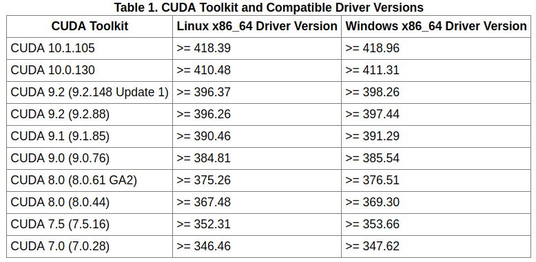
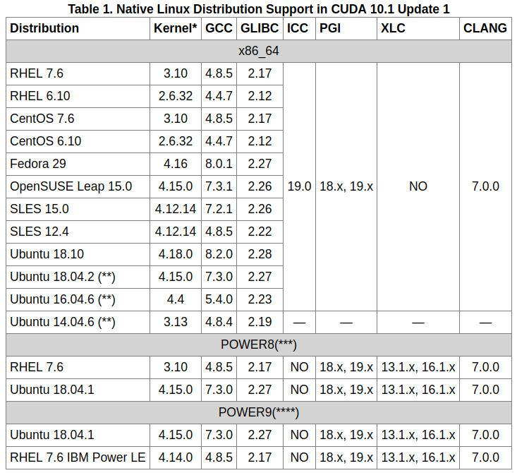

## Table of Contents
- [Caffe2环境准备](#env)
- [安装显卡驱动](#drivers)
- [安装CUDA](#cuda)
    - [选择CUDA版本](#cuda_version)
    - [安装CUDA](#cuda_install)
    - [设置环境变量](#cuda_env)
    - [检验安装](#cuda_check)
- [安装cuDNN](#cudnn)
- [安装Caffe2](#caffe2)
- [参考](#reference)

<a name="env" />

## Caffe2环境准备
我们以有显卡的情况为例，来安装caffe2环境，首先安装caffe2之前需要按照英伟达的显卡驱动，之后需要安装cuda toolkit和cuDNN，最后我们来安装Caffe2。  
我们先把需要的按照的软件列出来，再告诉如何选择对应的版本：  
* 操作系统: Ubuntu 16.04.5 LTS
* 显卡驱动版本: 384.130
* CUDA Toolkit版本: CUDA Toolkit 9.0
* cuDNN 版本: cuDNN v7.6.0
* pytorch 版本: pytorch-nightly-1.2.0

<a name="drivers" />

## 安装显卡驱动
由于是ubuntu 16.04可以在设置"System Settings - Software & Updates"中选择Using NVIDIA驱动。  
  
安装好驱动后可以通过下面的命令来验证驱动是否安装成功：  
```
root@root:~/cuda/$ nvidia-smi
Wed May 29 12:05:01 2019       
+-----------------------------------------------------------------------------+
| NVIDIA-SMI 384.130                Driver Version: 384.130                   |
|-------------------------------+----------------------+----------------------+
| GPU  Name        Persistence-M| Bus-Id        Disp.A | Volatile Uncorr. ECC |
| Fan  Temp  Perf  Pwr:Usage/Cap|         Memory-Usage | GPU-Util  Compute M. |
|===============================+======================+======================|
|   0  GeForce MX130       Off  | 00000000:02:00.0 Off |                  N/A |
| N/A   73C    P0    N/A /  N/A |   1240MiB /  2002MiB |     67%      Default |
+-------------------------------+----------------------+----------------------+
                                                                               
+-----------------------------------------------------------------------------+
| Processes:                                                       GPU Memory |
|  GPU       PID   Type   Process name                             Usage      |
|=============================================================================|
|    0      1682      G   /usr/lib/xorg/Xorg                           445MiB |
|    0      2744      G   compiz                                       192MiB |
|    0      3101      G   ...quest-channel-token=7501548652516259525   599MiB |
+-----------------------------------------------------------------------------+
```

<a name="cuda" />

## 安装CUDA

<a name="cuda_version" />

#### 选择CUDA版本
安装好显卡驱动后，就可以安装CUDA了，那么我们如何选择CUDA版本呢？首先查看显卡驱动版本，就是上面"nvidia-smi"显示的"Driver Version: 384.130"，然后查看下表，[官网地址](https://docs.nvidia.com/cuda/cuda-toolkit-release-notes/index.html)：  
  
可以看到驱动版本">= 390.46"选择CUDA 9.0，当然还需要查看下内核，GCC,GLIBC版本是否支持，参照下表，[官网地址](https://docs.nvidia.com/cuda/cuda-installation-guide-linux/index.html)：  
  

查看linux内核版本:  
```
root:~/cuda$ cat /proc/version
Linux version 4.15.0-50-generic (buildd@lgw01-amd64-029) (gcc version 5.4.0 20160609 (Ubuntu 5.4.0-6ubuntu1~16.04.10)) #54~16.04.1-Ubuntu SMP Wed May 8 15:55:19 UTC 2019

```

这里提供的是支持的CUDA10.1需要支持的设置，ubuntu 16.04已经支持了，所以9.0肯定也没有问题。  

<a name="cuda_install" />

#### 安装CUDA
之后下载CUDA，CUDA官方的[下载地址](https://developer.nvidia.com/cuda-toolkit-archive)，下载完成之后运行：  
```
sudo sh cuda_9.0.176_384.81_linux.run
```
**记住前面已经安装了驱动，所以安装CUDA的时候第一步需要跳过安装驱动，只安装CUDA Toolkit**，之后按照提示安装好之后就可以了。


<a name="cuda_env" />

#### 设置环境变量
安装完成之后，我们需要设置CUDA环境变量才能运行:  
```
sudo vi ~/.bashrc
```
在文件最后增加2行：  
```
export LD_LIBRARY_PATH="$LD_LIBRARY_PATH:/usr/local/cuda-9.0/lib64:/usr/local/cuda-9.0/extras/CUPTI/lib64"
export CUDA_HOME=/usr/local/cuda-9.0
```
将环境生效:  
```
source ~/.bashrc
```

<a name="cuda_check" />

#### 检验安装
检验安装是否成功，我们通过samples的deviceQuery来检验是否安装成功。  
```
cd /usr/local/cuda/samples/1_Utilities/deviceQuery 
sudo make
./deviceQuery
```
如果"Result = PASS"，则表示安装成功，如果提示"Result = FAIL"，则表示安装失败：  
```
$ ./deviceQuery 
./deviceQuery Starting...

 CUDA Device Query (Runtime API) version (CUDART static linking)

Detected 1 CUDA Capable device(s)

Device 0: "GeForce MX130"
  CUDA Driver Version / Runtime Version          9.0 / 9.0
  CUDA Capability Major/Minor version number:    5.0
  Total amount of global memory:                 2003 MBytes (2100232192 bytes)
  ( 3) Multiprocessors, (128) CUDA Cores/MP:     384 CUDA Cores
  GPU Max Clock rate:                            1189 MHz (1.19 GHz)
  Memory Clock rate:                             2505 Mhz
  Memory Bus Width:                              64-bit
  L2 Cache Size:                                 1048576 bytes
  Maximum Texture Dimension Size (x,y,z)         1D=(65536), 2D=(65536, 65536), 3D=(4096, 4096, 4096)
  Maximum Layered 1D Texture Size, (num) layers  1D=(16384), 2048 layers
  Maximum Layered 2D Texture Size, (num) layers  2D=(16384, 16384), 2048 layers
  Total amount of constant memory:               65536 bytes
  Total amount of shared memory per block:       49152 bytes
  Total number of registers available per block: 65536
  Warp size:                                     32
  Maximum number of threads per multiprocessor:  2048
  Maximum number of threads per block:           1024
  Max dimension size of a thread block (x,y,z): (1024, 1024, 64)
  Max dimension size of a grid size    (x,y,z): (2147483647, 65535, 65535)
  Maximum memory pitch:                          2147483647 bytes
  Texture alignment:                             512 bytes
  Concurrent copy and kernel execution:          Yes with 1 copy engine(s)
  Run time limit on kernels:                     Yes
  Integrated GPU sharing Host Memory:            No
  Support host page-locked memory mapping:       Yes
  Alignment requirement for Surfaces:            Yes
  Device has ECC support:                        Disabled
  Device supports Unified Addressing (UVA):      Yes
  Supports Cooperative Kernel Launch:            No
  Supports MultiDevice Co-op Kernel Launch:      No
  Device PCI Domain ID / Bus ID / location ID:   0 / 2 / 0
  Compute Mode:
     < Default (multiple host threads can use ::cudaSetDevice() with device simultaneously) >

deviceQuery, CUDA Driver = CUDART, CUDA Driver Version = 9.0, CUDA Runtime Version = 9.0, NumDevs = 1
Result = PASS
```

<a name="cudnn" />

## 安装cuDNN
我们安装好了CUDA之后，如果希望进行深度学习训练的时候能够加速，则需要安装"cuDNN"，这一部很简单，只需要根据CUDA的版本选择对应cuDNN的版本就可以了。  
可以在[官网](https://developer.nvidia.com/rdp/cudnn-download)上下载，CUDA 9.0对应的cuDNN版本为 v7.6.0，下载对应的linux版本。  
下载之后解压：  
```
tar -xzvf cudnn-9.0-linux-x64-v7.6.0.64.tgz
```
解压之后的文件如下:  
```
├──cuda
│   ├── include
│   │   └── cudnn.h
│   ├── lib64
│   │   ├── libcudnn.so -> libcudnn.so.7
│   │   ├── libcudnn.so.7 -> libcudnn.so.7.6.0
│   │   ├── libcudnn.so.7.6.0
│   │   └── libcudnn_static.a
│   └── NVIDIA_SLA_cuDNN_Support.txt
```
之后把文件拷贝到CUDA的目录下就可以了：  
```
sudo cp cuda/include/cudnn.h /usr/local/cuda-9.0/include
sudo cp cuda/lib64/libcudnn* /usr/local/cuda-9.0/lib64
```

经过上面的步骤，我们就安装好了CUDA的环境，主要是确认好CUDA的版本，如果版本不对，对应的检测就不通过。需要确认好支持的版本。  


<a name="caffe2" />

## 安装Caffe2
caffe2的环境选择直接用anaconda，因为anaconda集成大部分的工具，安装起来也很简单：
```
conda install pytorch-nightly -c pytorch
```
这是官网的[安装说明](https://caffe2.ai/docs/getting-started.html?platform=ubuntu&configuration=prebuilt)  


<a name="reference" />

## 参考
[Ubuntu16.04+Ananconda3+CUDA+CUDNN+Tensorflow-gpu配置教程](https://zhuanlan.zhihu.com/p/37569310)  
[ubuntu16.04下安装CUDA，cuDNN及tensorflow-gpu版本过程](https://blog.csdn.net/u014595019/article/details/53732015)  
