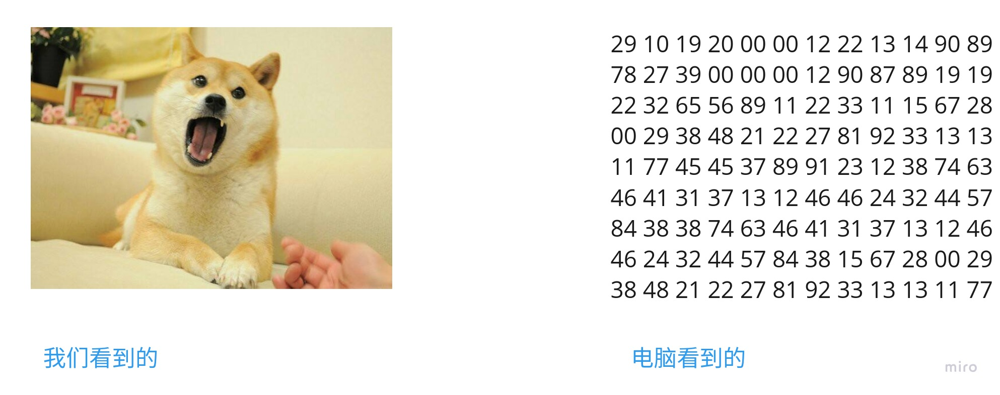
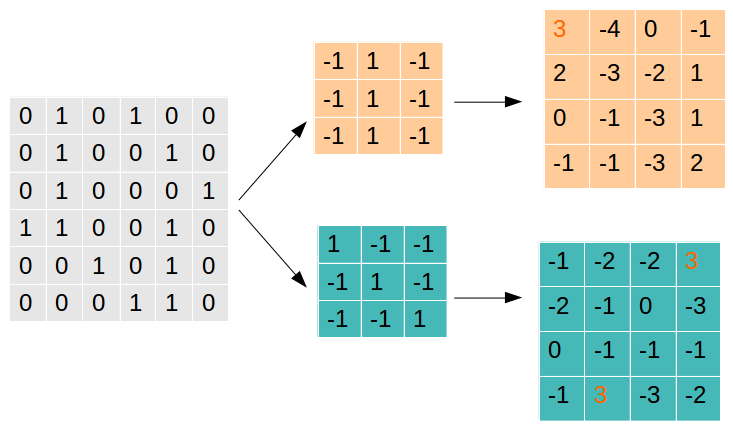

## Table of Contents
- [什么是CNN？](#what_is_cnn)
- [CNN的原理](#cnn_principle)
    - [卷积层(Convolutional Layer)](#convolutional)
    - [池化层(Max Pooling Layer)](#max_pool)
    - [全连接层(Fully Connected Layer)](#fully_connect)
- [如何构建CNN](#how_to)
- [基本概念](#base_concept)
- [引用](#reference)

<a name="what_is_cnn" />

## 什么是CNN？
首先什么是CNN呢？我们在这里模仿儿童的学习方式，当小孩子学习一个陌生东西的时候，往往会从问题开始，这里我们拿CNN做对比，来介绍什么是CNN。  
  
从上面的对话，我们知道CNN的全称是"Convolutional Neural Network"(卷积神经网络)。而神经网络是一种模仿生物神经网络（动物的中枢神经系统，特别是大脑）结构和功能的数学模型或计算模型。神经网络由大量的人工神经元组成，按不同的连接方式构建不同的网络。CNN是其中的一种，还有GAN(生成对抗网络)，RNN（递归神经网络）等，神经网络能够类似人一样具有简单的决定能力和简单的判断能力，在图像和语音识别方面能够给出更好的结果。  

<a name="cnn_principle" />

## CNN的原理
CNN被广泛应用在图像识别领域，那么CNN是如何实现图像识别的呢？我们根据图中的例子来解释CNN的原理。  
  
CNN是一种人工神经网络，CNN的结构可以分为3层：  
1. **卷积层(Convolutional Layer)** - 主要作用是提取特征。
2. **池化层(Max Pooling Layer)** - 主要作用是下采样(downsampling)，却不会损坏识别结果。
3. **全连接层(Fully Connected Layer)** - 主要作用是分类。

我们可以拿人类来做类比，比如你现在看到上图中的小鸟，人类如何识别它就是鸟的呢？首先你判断鸟的嘴是尖的，全身有羽毛和翅膀，有尾巴。然后通过这些联系起来判断这是一只鸟。而CNN的原理也类似，通过卷积层来查找特征，然后通过全连接层来做分类判断这是一只鸟，而池化层则是为了让训练的参数更少，在保持采样不变的情况下，忽略掉一些信息。  

<a name="convolutional" />

#### 卷积层(Convolutional Layer)
那么卷基层是如何提取特征的呢？我们都知道卷积就是2个函数的叠加，**应用在图像上，则可以理解为拿一个滤镜放在图像上，找出图像中的某些特征**，而我们需要找到很多特征才能区分某一物体，所以我们会有很多滤镜，通过这些滤镜的组合，我们可以得出很多的特征。  
首先一张图片在计算机中保存的格式为一个个的像素，比如一张长度为1080，宽度为1024的图片，总共包含了1080 * 1024的像素，如果为RGB图片，因为RGB图片由3种颜色叠加而成，包含3个通道，因此我们需要用1080 * 1024 * 3的数组来表示RGB图片。  
  
我们先从简单的情况开始考虑，假设我们有一组灰度图片，这样图片就可以表示为一个矩阵，假设我们的图片大小为5 * 5，那么我们就可以得到一个5 * 5的矩阵，接下来，我们用一组过滤器(Filter)来对图片过滤，过滤的过程就是求卷积的过程。假设我们的Filter的大小为3 * 3，我们从图片的左上角开始移动Filter，并且把每次矩阵相乘的结果记录下来。可以通过下面的过程来演示。  
  
每次Filter从矩阵的左上角开始移动，每次移动的步长是1，从左到右，从上到下，依次移动到矩阵末尾之后结束，每次都把Filter和矩阵对应的区域做乘法，得出一个新的矩阵。这其实就是做卷积的过程。而Filer的选择非常关键，Filter决定了过滤方式，通过不同的Filter会得到不同的特征。举一个例子就是：  
  
我们选择了2种Filter分别对图中的矩阵做卷积，可以看到值越大的就表示找到的特征越匹配，值越小的就表示找到的特征越偏离。Filter1主要是找到为"|"形状的特征，可以看到找到1处，转换后相乘值为3的网格就表示原始的图案中有"|"，而Filter2则表示找到"\\"形状的特征，我们可以看到在图中可以找到2处。拿真实的图像举例子，我们经过卷积层的处理之后，得到如下的一些特征结果：  
  

<a name="max_pool" />

#### 池化层(Max Pooling Layer)
经过卷积层处理的特征是否就可以直接用来分类了呢，答案是不能。我们假设一张图片的大小为500 * 500，经过50个Filter的卷积层之后，得到的结果为500 * 500 * 50"，维度非常大，我们需要减少数据大小，而不会对识别的结果产生影响，即对卷积层的输出做下采样(downsampling)，这时候就引入了池化层。池化层的原理很简单，先看一个例子：  
  
我们先从右边看起，可以看到把一个4 * 4的矩阵按照2 * 2做切分，每个2 * 2的矩阵里，我们取最大的值保存下来，红色的矩阵里面最大值为6，所以输出为6，绿色的矩阵最大值为8，输出为8，黄色的为3，蓝色的为4,。这样我们就把原来4 * 4的矩阵变为了一个2 * 2的矩阵。在看左边，我们发现原来224 * 224的矩阵，缩小为112 * 112了，减少了一半大小。  
那么为什么这样做可行呢？丢失的一部分数据会不会对结果有影响，实际上，池化层不会对数据丢失产生影响，因为我们每次保留的输出都是局部最显著的一个输出，**而池化之后，最显著的特征并没有丢失**。我们只保留了认为最显著的特征，而把其他无用的信息丢掉，来减少运算。池化层的引入还保证了平移不变性，即同样的图像经过翻转变形之后，通过池化层，可以得到相似的结果。  
既然是降采样，那么是否有其他方法实现降采样，也能达到同样的效果呢？当然有，通过其它的降采样方式，我们同样可以得到和池化层相同的结果，因此就可以拿这种方式替换掉池化层，可以起到相同的效果。  

<a name="fully_connect" />

#### 全连接层(Fully Connected Layer)
全连接层的作用主要是分类，前面通过卷积和池化层得出的特征，在全连接层对这些总结好的特征做分类。因为全连接层占用了神经网络80%的参数，因此对全连接层的优化就显得至关重要，现在也有用平均值来做最后的分类的。所以模型的过程也是提取特征->分类。

<a name="how_to" />

## 如何构建CNN
现在我们已经清楚了CNN的原理，那么现在你想不想动手做一个CNN呢？下面我们通过tensorflow来实现一个CNN神经网络的例子：  
首先读取数据，然后用tensorflow创建网络，之后就可以训练模型，并且查看模型训练的情况，最后保存训练好的模型。  

https://www.tensorflow.org/tutorials/estimators/cnn  

<a name="base_concept" />

## 基本概念
* **卷积核** - 卷积核就是图像处理时，给定输入图像，在输出图像中每一个像素是输入图像中一个小区域中像素的加权平均，其中权值由一个函数定义，这个函数称为卷积核。[kernel](https://en.wikipedia.org/wiki/Kernel_(image_processing))  
* **卷积** 卷积可以对应到2个函数叠加，因此用一个filter和图片叠加就可以求出整个图片的情况，可以用在图像的边缘检测，图片锐化，模糊等方面。[Convolution](https://en.wikipedia.org/wiki/Convolution)  

## 论文汇总
// todo

<a name="reference" />

## 引用
[A Beginner's Guide to Convolutional Neural Networks (CNNs)](https://skymind.ai/wiki/convolutional-network)  
[A Beginner's Guide To Understanding Convolutional Neural Networks](https://adeshpande3.github.io/A-Beginner%27s-Guide-To-Understanding-Convolutional-Neural-Networks/)  
[Convolutional Neural Networks (CNNs / ConvNets)](http://cs231n.github.io/convolutional-networks/)  
[An intuitive guide to Convolutional Neural Networks](https://www.freecodecamp.org/news/an-intuitive-guide-to-convolutional-neural-networks-260c2de0a050/)  
