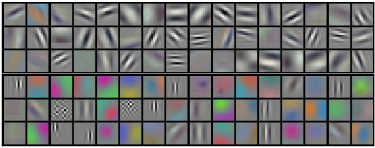
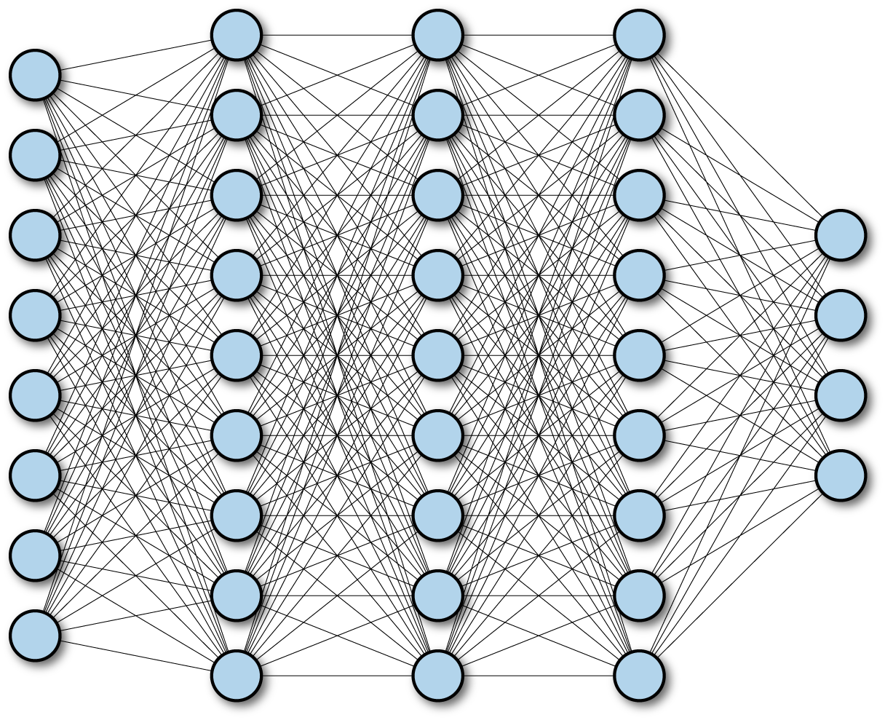
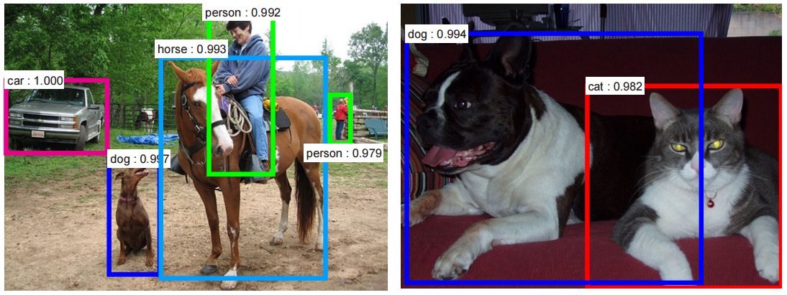
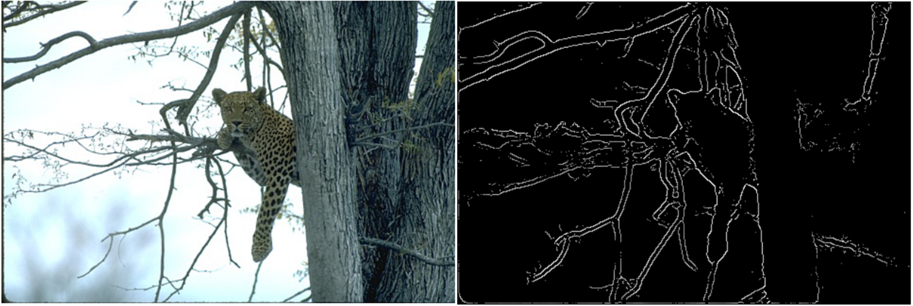

## Table of Contents
- [什么是CNN？](#what_is_cnn)
- [CNN的原理](#cnn_principle)
    - [卷积层(Convolutional Layer)](#convolutional)
    - [池化层(Max Pooling Layer)](#max_pool)
    - [全连接层(Fully Connected Layer)](#fully_connect)
- [如何构建CNN](#how_to)
- [基本概念](#base_concept)
- [论文汇总](#paper)
- [引用](#reference)

<a name="what_is_cnn" />

## 什么是CNN？
首先什么是CNN呢？我们在这里模仿儿童的学习方式，当小孩子学习一个陌生东西的时候，往往会从问题开始，这里我们拿CNN做对比，来介绍什么是CNN。  
  
从上面的对话，我们知道CNN的全称是"Convolutional Neural Network"(卷积神经网络)。而神经网络是一种模仿生物神经网络（动物的中枢神经系统，特别是大脑）结构和功能的数学模型或计算模型。神经网络由大量的人工神经元组成，按不同的连接方式构建不同的网络。CNN是其中的一种，还有GAN(生成对抗网络)，RNN（递归神经网络）等，神经网络能够类似人一样具有简单的决定能力和简单的判断能力，在图像和语音识别方面能够给出更好的结果。  

<a name="cnn_principle" />

## CNN的原理
CNN被广泛应用在图像识别领域，那么CNN是如何实现图像识别的呢？我们根据图中的例子来解释CNN的原理。  
  
CNN是一种人工神经网络，CNN的结构可以分为3层：  
1. **卷积层(Convolutional Layer)** - 主要作用是提取特征。
2. **池化层(Max Pooling Layer)** - 主要作用是下采样(downsampling)，却不会损坏识别结果。
3. **全连接层(Fully Connected Layer)** - 主要作用是分类。

我们可以拿人类来做类比，比如你现在看到上图中的小鸟，人类如何识别它就是鸟的呢？首先你判断鸟的嘴是尖的，全身有羽毛和翅膀，有尾巴。然后通过这些联系起来判断这是一只鸟。而CNN的原理也类似，通过卷积层来查找特征，然后通过全连接层来做分类判断这是一只鸟，而池化层则是为了让训练的参数更少，在保持采样不变的情况下，忽略掉一些信息。  

<a name="convolutional" />

#### 卷积层(Convolutional Layer)
那么卷基层是如何提取特征的呢？我们都知道卷积就是2个函数的叠加，**应用在图像上，则可以理解为拿一个滤镜放在图像上，找出图像中的某些特征**，而我们需要找到很多特征才能区分某一物体，所以我们会有很多滤镜，通过这些滤镜的组合，我们可以得出很多的特征。  
首先一张图片在计算机中保存的格式为一个个的像素，比如一张长度为1080，宽度为1024的图片，总共包含了1080 * 1024的像素，如果为RGB图片，因为RGB图片由3种颜色叠加而成，包含3个通道，因此我们需要用1080 * 1024 * 3的数组来表示RGB图片。  
  
我们先从简单的情况开始考虑，假设我们有一组灰度图片，这样图片就可以表示为一个矩阵，假设我们的图片大小为5 * 5，那么我们就可以得到一个5 * 5的矩阵，接下来，我们用一组过滤器(Filter)来对图片过滤，过滤的过程就是求卷积的过程。假设我们的Filter的大小为3 * 3，我们从图片的左上角开始移动Filter，并且把每次矩阵相乘的结果记录下来。可以通过下面的过程来演示。  
  
每次Filter从矩阵的左上角开始移动，每次移动的步长是1，从左到右，从上到下，依次移动到矩阵末尾之后结束，每次都把Filter和矩阵对应的区域做乘法，得出一个新的矩阵。这其实就是做卷积的过程。而Filer的选择非常关键，Filter决定了过滤方式，通过不同的Filter会得到不同的特征。举一个例子就是：  
  
我们选择了2种Filter分别对图中的矩阵做卷积，可以看到值越大的就表示找到的特征越匹配，值越小的就表示找到的特征越偏离。Filter1主要是找到为"|"形状的特征，可以看到找到1处，转换后相乘值为3的网格就表示原始的图案中有"|"，而Filter2则表示找到"\\"形状的特征，我们可以看到在图中可以找到2处。拿真实的图像举例子，我们经过卷积层的处理之后，得到如下的一些特征结果：  
  


<a name="max_pool" />

#### 池化层(Max Pooling Layer)
经过卷积层处理的特征是否就可以直接用来分类了呢，答案是不能。我们假设一张图片的大小为500 * 500，经过50个Filter的卷积层之后，得到的结果为500 * 500 * 50"，维度非常大，我们需要减少数据大小，而不会对识别的结果产生影响，即对卷积层的输出做下采样(downsampling)，这时候就引入了池化层。池化层的原理很简单，先看一个例子：  
  
我们先从右边看起，可以看到把一个4 * 4的矩阵按照2 * 2做切分，每个2 * 2的矩阵里，我们取最大的值保存下来，红色的矩阵里面最大值为6，所以输出为6，绿色的矩阵最大值为8，输出为8，黄色的为3，蓝色的为4,。这样我们就把原来4 * 4的矩阵变为了一个2 * 2的矩阵。在看左边，我们发现原来224 * 224的矩阵，缩小为112 * 112了，减少了一半大小。  
那么为什么这样做可行呢？丢失的一部分数据会不会对结果有影响，实际上，池化层不会对数据丢失产生影响，因为我们每次保留的输出都是局部最显著的一个输出，**而池化之后，最显著的特征并没有丢失**。我们只保留了认为最显著的特征，而把其他无用的信息丢掉，来减少运算。池化层的引入还保证了平移不变性，即同样的图像经过翻转变形之后，通过池化层，可以得到相似的结果。  
既然是降采样，那么是否有其他方法实现降采样，也能达到同样的效果呢？当然有，通过其它的降采样方式，我们同样可以得到和池化层相同的结果，因此就可以拿这种方式替换掉池化层，可以起到相同的效果。  

> 通常卷积层和池化层会重复多次形成具有多个隐藏层的网络，俗称深度神经网络。

<a name="fully_connect" />

#### 全连接层(Fully Connected Layer)
全连接层的作用主要是进行分类。**前面通过卷积和池化层得出的特征，在全连接层对这些总结好的特征做分类**。全连接层就是一个完全连接的神经网络，根据权重每个神经元反馈的比重不一样，最后通过调整权重和网络得到分类的结果。  
  
因为全连接层占用了神经网络80%的参数，因此对全连接层的优化就显得至关重要，现在也有用平均值来做最后的分类的。  


<a name="how_to" />

## 如何构建CNN
现在我们已经清楚了CNN的原理，那么现在你想不想动手做一个CNN呢？下面我们通过tensorflow来实现一个CNN神经网络的例子：  
1. 首先我们需要载入tensorflow环境，python代码如下:  
```
from __future__ import absolute_import
from __future__ import division
from __future__ import print_function

# Imports
import numpy as np
import tensorflow as tf

tf.logging.set_verbosity(tf.logging.INFO)

# Our application logic will be added here

if __name__ == "__main__":
  tf.app.run()
```
其中tf.layers模块包含用于创建上述3种层的方法：  
* conv2d()。构建一个二维卷积层。接受的参数为过滤器数量，过滤器核大小，填充和激活函数。  
* max_pooling2d()。构建一个使用最大池化算法的二维池化层。接受的参数为池化过滤器大小和步长。  
* dense()。构建全连接层，接受的岑姝为神经元数量和激活函数。  
上述这些方法都接受张量作为输入，并返回转换后的张量作为输出。这样可轻松地将一个层连接到另一个层：只需从一个层创建方法中获取输出，并将其作为输入提供给另一个层即可。  

#### 输入层
对输入进行转换，输入的张量的形状应该为[batch_size, image_height, image_width, channels]。  
* batch_size。在训练期间执行梯度下降法时使用的样本子集的大小。
* image_height。样本图像的高度。
* image_width。样本图像的宽度。
* channels。样本图像中颜色通道的数量。彩色图像有 3 个通道（红色、绿色、蓝色）。单色图像只有 1 个通道（黑色）。

```
input_layer = tf.reshape(features["x"], [-1, 28, 28, 1])
```

#### 卷积层
我们的第一个卷积层创建32个5 * 5的过滤器。  
```
conv1 = tf.layers.conv2d(
    inputs=input_layer,
    filters=32,
    kernel_size=[5, 5],
    padding="same",
    activation=tf.nn.relu)
```

#### 池化层
接下来，我们将第一个池化层连接到刚刚创建的卷积层。
```
pool1 = tf.layers.max_pooling2d(inputs=conv1, pool_size=[2, 2], strides=2)
```

#### 卷积层2和池化层2
对于卷积层 2，我们配置 64 个 5x5 过滤器，并应用 ReLU 激活函数；对于池化层 2，我们使用与池化层 1 相同的规格（一个 2x2 最大池化过滤器，步长为2）：  
```
conv2 = tf.layers.conv2d(
    inputs=pool1,
    filters=64,
    kernel_size=[5, 5],
    padding="same",
    activation=tf.nn.relu)

pool2 = tf.layers.max_pooling2d(inputs=conv2, pool_size=[2, 2], strides=2)
```

#### 全连接层
接下来，我们需要向CNN添加全连接层（具有1024个神经元和ReLU激活函数），以对卷积/池化层提取的特征执行分类。不过，在我们连接该层之前，我们需要先扁平化特征图(pool2)，以将其变形为 [batch_size, features]，使张量只有两个维度：
```
pool2_flat = tf.reshape(pool2, [-1, 7 * 7 * 64])
```
在上面的 reshape() 操作中，-1 表示 batch_size 维度将根据输入数据中的样本数量动态计算。每个样本都具有 7（pool2 高度）* 7（pool2 宽度）* 64（pool2 通道）个特征。
```
dense = tf.layers.dense(inputs=pool2_flat, units=1024, activation=tf.nn.relu)
```
为了改善模型的结果，我们还会使用 layers 中的 dropout 方法，向密集层应用丢弃正则化：  
```
dropout = tf.layers.dropout(
    inputs=dense, rate=0.4, training=mode == tf.estimator.ModeKeys.TRAIN)
```

#### 对数层
我们的神经网络中的最后一层是对数层，该层返回预测的原始值。我们创建一个具有 10 个神经元（介于 0 到 9 之间的每个目标类别对应一个神经元）的密集层，并应用线性激活函数（默认函数）：  
```
logits = tf.layers.dense(inputs=dropout, units=10)
```

#### 生成预测
```
tf.argmax(input=logits, axis=1)
```

我们可以使用 tf.nn.softmax 应用 softmax 激活函数，以从对数层中得出概率：  
```
tf.nn.softmax(logits, name="softmax_tensor")
```
我们将预测编译为字典，并返回:  
```
predictions = {
    "classes": tf.argmax(input=logits, axis=1),
    "probabilities": tf.nn.softmax(logits, name="softmax_tensor")
}
if mode == tf.estimator.ModeKeys.PREDICT:
  return tf.estimator.EstimatorSpec(mode=mode, predictions=predictions)
```


<a name="base_concept" />

## 基本概念
* **卷积核** - 卷积核就是图像处理时，给定输入图像，在输出图像中每一个像素是输入图像中一个小区域中像素的加权平均，其中权值由一个函数定义，这个函数称为卷积核。[kernel](https://en.wikipedia.org/wiki/Kernel_(image_processing))  
* **卷积** 卷积可以对应到2个函数叠加，因此用一个filter和图片叠加就可以求出整个图片的情况，可以用在图像的边缘检测，图片锐化，模糊等方面。[Convolution](https://en.wikipedia.org/wiki/Convolution)  


<a name="paper" />

## 论文汇总
####　ImageNet分类
  
- Microsoft (Deep Residual Learning)[Paper](https://arxiv.org/pdf/1512.03385v1.pdf)[Slide](http://image-net.org/challenges/talks/ilsvrc2015_deep_residual_learning_kaiminghe.pdf)  
    - Kaiming He, Xiangyu Zhang, Shaoqing Ren, Jian Sun, Deep Residual Learning for Image Recognition, arXiv:1512.03385.
- Microsoft (PReLu/Weight initialization)[Paper](https://arxiv.org/pdf/1502.01852.pdf)  
    - Kaiming He, Xiangyu Zhang, Shaoqing Ren, Jian Sun, Delving Deep into Rectifiers: Surpassing Human-Level Performance on ImageNet Classification, arXiv:1502.01852.
- Batch Normalization [Paper](https://arxiv.org/pdf/1502.03167.pdf)  
    - Sergey Ioffe, Christian Szegedy, Batch Normalization: Accelerating Deep Network Training by Reducing Internal Covariate Shift, arXiv:1502.03167.
- GoogLeNet[Paper]()
    - Christian Szegedy, Wei Liu, Yangqing Jia, Pierre Sermanet, Scott Reed, Dragomir Anguelov, Dumitru Erhan, Vincent Vanhoucke, Andrew Rabinovich, CVPR, 2015.
- VGG-Net[Web](http://www.robots.ox.ac.uk/~vgg/research/very_deep/)[Paper](https://arxiv.org/pdf/1409.1556.pdf)
    - Karen Simonyan and Andrew Zisserman, Very Deep Convolutional Networks for Large-Scale Visual Recognition, ICLR, 2015.
- AlexNet [Paper]()
    - Alex Krizhevsky, Ilya Sutskever, Geoffrey E. Hinton, ImageNet Classification with Deep Convolutional Neural Networks, NIPS, 2012.

#### 物体检测(Object Detection)

- PVANET [paper](https://arxiv.org/pdf/1608.08021.pdf)[Code](https://github.com/sanghoon/pva-faster-rcnn)
    - Kye-Hyeon Kim, Sanghoon Hong, Byungseok Roh, Yeongjae Cheon, Minje Park, PVANET: Deep but Lightweight Neural Networks for Real-time Object Detection, arXiv:1608.08021
- OverFeat, NYU [Paper](https://arxiv.org/pdf/1312.6229.pdf)
    - OverFeat: Integrated Recognition, Localization and Detection using Convolutional Networks, ICLR, 2014.
- R-CNN, UC Berkeley [Paper-CVPR14](https://www.cv-foundation.org/openaccess/content_cvpr_2014/papers/Girshick_Rich_Feature_Hierarchies_2014_CVPR_paper.pdf)[Paper-arXiv14](https://arxiv.org/pdf/1311.2524.pdf)
    - Ross Girshick, Jeff Donahue, Trevor Darrell, Jitendra Malik, Rich feature hierarchies for accurate object detection and semantic segmentation, CVPR, 2014.
- SPP, Microsoft Research [Paper]
    - Kaiming He, Xiangyu Zhang, Shaoqing Ren, Jian Sun, Spatial Pyramid Pooling in Deep Convolutional Networks for Visual Recognition, ECCV, 2014.
- Fast R-CNN, Microsoft Research [Paper](https://arxiv.org/pdf/1504.08083.pdf)
    - Ross Girshick, Fast R-CNN, arXiv:1504.08083.
- Faster R-CNN, Microsoft Research [Paper](https://arxiv.org/pdf/1506.01497.pdf)
    - Shaoqing Ren, Kaiming He, Ross Girshick, Jian Sun, Faster R-CNN: Towards Real-Time Object Detection with Region Proposal Networks, arXiv:1506.01497.
- R-CNN minus R, Oxford [Paper](https://arxiv.org/pdf/1506.06981.pdf)
    - Karel Lenc, Andrea Vedaldi, R-CNN minus R, arXiv:1506.06981.
- End-to-end people detection in crowded scenes [Paper](https://arxiv.org/abs/1506.04878)
    - Russell Stewart, Mykhaylo Andriluka, End-to-end people detection in crowded scenes, arXiv:1506.04878.
- You Only Look Once: Unified, Real-Time object Detection [Paper](https://arxiv.org/abs/1506.02640), [Paper Version 2](https://arxiv.org/abs/1612.08242), [C Code](https://github.com/pjreddie/darknet), [Tensorflow Code](https://github.com/thtrieu/darkflow)
    - Joseph Redmon, Santosh Divvala, Ross Girshick, Ali Farhadi, You Only Look Once: Unified, Real-Time Object Detection, arXiv:1506.02640
    - Joseph Redmon, Ali Farhadi (Version 2)
- Inside-Outside Net [Paper](https://arxiv.org/abs/1512.04143)
    - Sean Bell, C. Lawrence Zitnick, Kavita Bala, Ross Girshick, Inside-Outside Net: Detecting Objects in Context with Skip Pooling and Recurrent Neural Networks
- Deep Residual Network (Current State-of-the-Art) [Paper](https://arxiv.org/abs/1512.03385)
    - Kaiming He, Xiangyu Zhang, Shaoqing Ren, Jian Sun, Deep Residual Learning for Image Recognition
- Weakly Supervised Object Localization with Multi-fold Multiple instance Learning [Paper](https://arxiv.org/pdf/1503.00949.pdf)
- R-FCN [Paper](https://arxiv.org/abs/1605.06409)[Code](https://github.com/daijifeng001/R-FCN)
    - Jifeng Dai, Yi Li, Kaiming He, Jian Sun, R-FCN: Object Detection via Region-based Fully Convolutional Networks
- SSD [Paper](https://arxiv.org/pdf/1512.02325v2.pdf)[Code](https://github.com/weiliu89/caffe/tree/ssd)
    - Wei Liu1, Dragomir Anguelov, Dumitru Erhan, Christian Szegedy, Scott Reed, Cheng-Yang Fu, Alexander C. Berg, SSD: Single Shot MultiBox Detector, arXiv:1512.02325
- Speed/accuracy trade-offs for modern convolutional object detectors [Paper](https://arxiv.org/pdf/1611.10012v1.pdf)
    - Jonathan Huang, Vivek Rathod, Chen Sun, Menglong Zhu, Anoop Korattikara, Alireza Fathi, Ian Fischer, Zbigniew Wojna, Yang Song, Sergio Guadarrama, Kevin Murphy, Google Research, arXiv:1611.10012

#### 视频分类(Video Classification)
- Nicolas Ballas, Li Yao, Pal Chris, Aaron Courville, “Delving Deeper into Convolutional Networks for Learning Video Representations”, ICLR 2016. [Paper](https://arxiv.org/pdf/1511.06432v4.pdf)
- Michael Mathieu, camille couprie, Yann Lecun, “Deep Multi Scale Video Prediction Beyond Mean Square Error”, ICLR 2016. [Paper](https://arxiv.org/pdf/1511.05440v6.pdf)


#### 对象跟踪(Object Tracking)
- Seunghoon Hong, Tackgeun You, Suha Kwak, Bohyung Han, Online Tracking by Learning Discriminative Saliency Map with Convolutional Neural Network, arXiv:1502.06796. [Paper](https://arxiv.org/pdf/1502.06796.pdf)
- Hanxi Li, Yi Li and Fatih Porikli, DeepTrack: Learning Discriminative Feature Representations by Convolutional Neural Networks for Visual Tracking, BMVC, 2014. [Paper](http://www.bmva.org/bmvc/2014/files/paper028.pdf)
- N Wang, DY Yeung, Learning a Deep Compact Image Representation for Visual Tracking, NIPS, 2013. [Paper](http://winsty.net/papers/dlt.pdf)
- N Wang, DY Yeung, Learning a Deep Compact Image Representation for Visual Tracking, NIPS, 2013. [Paper](http://winsty.net/papers/dlt.pdf)
- Chao Ma, Jia-Bin Huang, Xiaokang Yang and Ming-Hsuan Yang, Hierarchical Convolutional Features for Visual Tracking, ICCV 2015 [Paper](https://www.cv-foundation.org/openaccess/content_iccv_2015/papers/Ma_Hierarchical_Convolutional_Features_ICCV_2015_paper.pdf)[Code](https://github.com/jbhuang0604/CF2)
- Lijun Wang, Wanli Ouyang, Xiaogang Wang, and Huchuan Lu, Visual Tracking with fully Convolutional Networks, ICCV 2015 [Paper](http://202.118.75.4/lu/Paper/ICCV2015/iccv15_lijun.pdf)[Code](https://github.com/scott89/FCNT)
- Hyeonseob Namand Bohyung Han, Learning Multi-Domain Convolutional Neural Networks for Visual Tracking, [Paper](https://arxiv.org/pdf/1510.07945.pdf)[Code](https://github.com/HyeonseobNam/MDNet)[Project Page](http://cvlab.postech.ac.kr/research/mdnet/)


## 底层视觉(Low-Level Vision)
#### 超分辨率(Super-Resolution)
- 迭代图像重建(Iterative Image Reconstruction)
    - Sven Behnke: Learning Iterative Image Reconstruction. IJCAI, 2001. [Paper](http://www.ais.uni-bonn.de/behnke/papers/ijcai01.pdf)
    - Sven Behnke: Learning Iterative Image Reconstruction in the Neural Abstraction Pyramid. International Journal of Computational Intelligence and Applications, vol. 1, no. 4, pp. 427-438, 2001. [Paper](http://www.ais.uni-bonn.de/behnke/papers/ijcia01.pdf)
- Super-Resolution (SRCNN) [Web](http://mmlab.ie.cuhk.edu.hk/projects/SRCNN.html) [Paper-ECCV14](http://personal.ie.cuhk.edu.hk/~ccloy/files/eccv_2014_deepresolution.pdf) [Paper-arXiv15](https://arxiv.org/pdf/1501.00092.pdf)
    - Chao Dong, Chen Change Loy, Kaiming He, Xiaoou Tang, Learning a Deep Convolutional Network for Image Super-Resolution, ECCV, 2014.
    - Chao Dong, Chen Change Loy, Kaiming He, Xiaoou Tang, Image Super-Resolution Using Deep Convolutional Networks, arXiv:1501.00092.
- Very Deep Super-Resolution
    - Jiwon Kim, Jung Kwon Lee, Kyoung Mu Lee, Accurate Image Super-Resolution Using Very Deep Convolutional Networks, arXiv:1511.04587, 2015. [Paper](https://arxiv.org/abs/1511.04587)
- Deeply-Recursive Convolutional Network
    - Jiwon Kim, Jung Kwon Lee, Kyoung Mu Lee, Deeply-Recursive Convolutional Network for Image Super-Resolution, arXiv:1511.04491, 2015. [Paper](https://arxiv.org/abs/1511.04491)
- Casade-Sparse-Coding-Network
    - Zhaowen Wang, Ding Liu, Wei Han, Jianchao Yang and Thomas S. Huang, Deep Networks for Image Super-Resolution with Sparse Prior. ICCV, 2015. [Paper](http://www.ifp.illinois.edu/~dingliu2/iccv15/iccv15.pdf) [Code](http://www.ifp.illinois.edu/~dingliu2/iccv15/)
- Perceptual Losses for Super-Resolution
    - Justin Johnson, Alexandre Alahi, Li Fei-Fei, Perceptual Losses for Real-Time Style Transfer and Super-Resolution, arXiv:1603.08155, 2016. [Paper](https://arxiv.org/abs/1603.08155) [Supplementary](https://cs.stanford.edu/people/jcjohns/papers/fast-style/fast-style-supp.pdf)
- SRGAN
    - Christian Ledig, Lucas Theis, Ferenc Huszar, Jose Caballero, Andrew Cunningham, Alejandro Acosta, Andrew Aitken, Alykhan Tejani, Johannes Totz, Zehan Wang, Wenzhe Shi, Photo-Realistic Single Image Super-Resolution Using a Generative Adversarial Network, arXiv:1609.04802v3, 2016. [Paper](https://arxiv.org/pdf/1609.04802v3.pdf)
- Others
    - Osendorfer, Christian, Hubert Soyer, and Patrick van der Smagt, Image Super-Resolution with Fast Approximate Convolutional Sparse Coding, ICONIP, 2014. [Paper ICONIP-2014](http://brml.org/uploads/tx_sibibtex/281.pdf)

#### 其他应用(Other Applications)
- Optical Flow (FlowNet) [Paper](http://arxiv.org/pdf/1504.06852)
    - Philipp Fischer, Alexey Dosovitskiy, Eddy Ilg, Philip Häusser, Caner Hazırbaş, Vladimir Golkov, Patrick van der Smagt, Daniel Cremers, Thomas Brox, FlowNet: Learning Optical Flow with Convolutional Networks, arXiv:1504.06852.
- Compression Artifacts Reduction [Paper-arXiv15](http://arxiv.org/pdf/1504.06993)
    - Chao Dong, Yubin Deng, Chen Change Loy, Xiaoou Tang, Compression Artifacts Reduction by a Deep Convolutional Network, arXiv:1504.06993.
- Blur Removal
    - Christian J. Schuler, Michael Hirsch, Stefan Harmeling, Bernhard Schölkopf, Learning to Deblur, arXiv:1406.7444 [Paper](https://arxiv.org/pdf/1406.7444.pdf)
    - Jian Sun, Wenfei Cao, Zongben Xu, Jean Ponce, Learning a Convolutional Neural Network for Non-uniform Motion Blur Removal, CVPR, 2015 [Paper](https://arxiv.org/pdf/1503.00593.pdf)
- Image Deconvolution [Web](http://lxu.me/projects/dcnn/) [Paper](http://lxu.me/mypapers/dcnn_nips14.pdf)
    - Li Xu, Jimmy SJ. Ren, Ce Liu, Jiaya Jia, Deep Convolutional Neural Network for Image Deconvolution, NIPS, 2014.
- Deep Edge-Aware Filter [Paper](http://proceedings.mlr.press/v37/xub15.pdf)
    - Li Xu, Jimmy SJ. Ren, Qiong Yan, Renjie Liao, Jiaya Jia, Deep Edge-Aware Filters, ICML, 2015.
- Computing the Stereo Matching Cost with a Convolutional Neural Network [Paper](https://www.cv-foundation.org/openaccess/content_cvpr_2015/papers/Zbontar_Computing_the_Stereo_2015_CVPR_paper.pdf)
    - Jure Žbontar, Yann LeCun, Computing the Stereo Matching Cost with a Convolutional Neural Network, CVPR, 2015.
- Colorful Image Colorization Richard Zhang, Phillip Isola, Alexei A. Efros, ECCV, 2016 [Paper](http://arxiv.org/pdf/1603.08511.pdf), [Code](https://github.com/richzhang/colorization)
- Ryan Dahl, [Blog](https://tinyclouds.org/colorize/)
- Feature Learning by Inpainting[Paper](https://arxiv.org/pdf/1604.07379v1.pdf)[Code](https://github.com/pathak22/context-encoder)
    - Deepak Pathak, Philipp Krahenbuhl, Jeff Donahue, Trevor Darrell, Alexei A. Efros, Context Encoders: Feature Learning by Inpainting, CVPR, 2016

#### 边缘检测(Edge Detection)

- Holistically-Nested Edge Detection [Paper](https://arxiv.org/pdf/1504.06375.pdf) [Code](https://github.com/s9xie/hed)
    - Saining Xie, Zhuowen Tu, Holistically-Nested Edge Detection, arXiv:1504.06375.
- DeepEdge [Paper](http://arxiv.org/pdf/1412.1123)
    - Gedas Bertasius, Jianbo Shi, Lorenzo Torresani, DeepEdge: A Multi-Scale Bifurcated Deep Network for Top-Down Contour Detection, CVPR, 2015.
- DeepContour [Paper](http://mc.eistar.net/UpLoadFiles/Papers/DeepContour_cvpr15.pdf)
    - Wei Shen, Xinggang Wang, Yan Wang, Xiang Bai, Zhijiang Zhang, DeepContour: A Deep Convolutional Feature Learned by Positive-Sharing Loss for Contour Detection, CVPR, 2015.


#### 语义分割(Semantic Segmentation)


    
<a name="reference" />

## 引用
[A Beginner's Guide to Convolutional Neural Networks (CNNs)](https://skymind.ai/wiki/convolutional-network)  
[A Beginner's Guide To Understanding Convolutional Neural Networks](https://adeshpande3.github.io/A-Beginner%27s-Guide-To-Understanding-Convolutional-Neural-Networks/)  
[Convolutional Neural Networks (CNNs / ConvNets)](http://cs231n.github.io/convolutional-networks/)  
[An intuitive guide to Convolutional Neural Networks](https://www.freecodecamp.org/news/an-intuitive-guide-to-convolutional-neural-networks-260c2de0a050/)  
[Fully Connected Deep Networks](https://www.oreilly.com/library/view/tensorflow-for-deep/9781491980446/ch04.html)  
[使用 Estimator 构建卷积神经网络](https://www.tensorflow.org/tutorials/estimators/cnn?hl=zh-cn)  
