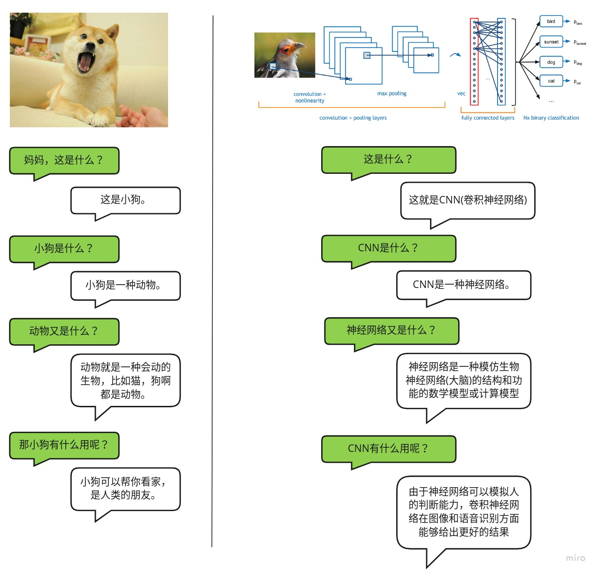

# Dig into Apollo - Perception 

> 温故而知新，可以为师矣


## Table of Contents
- [Perception模块简介](#introduction)
- [基础知识](#base)


## 基础知识

## CNN
首先CNN是什么呢？当我们给小孩教一个陌生东西的时候，我们往往需要回答以下几个问题：  
  
我们可以参照上面的过程来介绍下CNN，CNN的全称是"Convolutional Neural Network"(卷积神经网络)。  
  


#### Convolutional layer(卷积层)
主要功能是提取特征。  


#### Max Pooling(池化层)
Max pooling的主要功能是downsampling，却不会损坏识别结果。首先的回答2个问题：  
1. 采样不变性，即去除掉这些信息之后，不会影响模型的能力。  
2. 其次才是减少运算。  
所以如果去除这部分信息确实是可以的，那么就可以直接过滤掉。过滤之后即不影响信息，而且可以减少运算，那么就更好了。  

既然作用是降采样，那么是否有其他方法实现降采样，也能达到同样的效果呢？  

参考阅读
https://www.zhihu.com/question/36686900  
https://www.zhihu.com/question/41948919  


#### Fully Connected Layer(全连接层)

关于全连接层的作用，全连接层的作用主要是分类，前面通过卷积和池化层得出的特征，在全连接层对这些总结好的特征做分类。因为全连接层占用了神经网络80%的参数，因此对全连接层的优化就显得至关重要，现在也有用平均值来做最后的分类的。所以模型的过程也是提取特征->分类。  

**卷积核** - 卷积核就是图像处理时，给定输入图像，在输出图像中每一个像素是输入图像中一个小区域中像素的加权平均，其中权值由一个函数定义，这个函数称为卷积核。[kernel](https://en.wikipedia.org/wiki/Kernel_(image_processing))  


## 卷积
卷积可以对应到2个函数叠加，因此用一个filter和图片叠加就可以求出整个图片的情况，可以用在图像的边缘检测，图片锐化，模糊等方面。  
[Convolution](https://en.wikipedia.org/wiki/Convolution)  


## tensorflow例子

如何通过tensorflow创建并且运行例子呢？可以参考下面的链接，首先读取数据，然后用tensorflow创建网络，之后就可以训练模型，并且查看模型训练的情况，最后保存训练好的模型。  

https://www.tensorflow.org/tutorials/estimators/cnn  


<a name="introduction" />

## Perception模块简介

我们先看下perception的目录结构：  
```
.
├── base         // 基础类
├── BUILD        // 编译testdata，用于测试
├── camera       // 摄像头
├── common       // 公共目录
├── data
├── fusion       // 融合
├── inference    // 推理
├── lib          // lib库
├── lidar        // 雷达
├── map          // 地图
├── onboard      // 消息处理
├── production   // 加载模块
├── proto        // 数据格式，protobuf
├── radar        // 毫米波
├── README.md
└── testdata    // 上述几个模块的测试数据，包括训练好的模型
```
apollo的感知模块没有开放训练模型，只是开放了testdata，下载训练好的模型之后来跑一个简单的Demo。  

## radar
我们先从一个简单的模块开始看起，首先看下radar目录：  
```
.
├── app          // 每个模块都有一个app目录
├── common       // 公共目录
└── lib          // 库
```


radar模块被"RadarDetectionComponent"引用，perception的入口在onboard中。我们最后分析下"RadarDetectionComponent"模块。  


## tools
obstacle_detection 根据kitti的例子，对camera做完整流程的识别，如果需要入门，可以把这个例子先跑通，同时也可以拿这个例子进行性能调优。  

lane_detection 车道线识别的例子


## Reference
[A Beginner's Guide to Convolutional Neural Networks](https://skymind.ai/wiki/convolutional-network)  
[cnn](https://cs231n.github.io/convolutional-networks/)  
[traffic light dataset](https://hci.iwr.uni-heidelberg.de/node/6132/download/3d66608cfb112934ef40175e9a20c81f)  
[pytorch-tutorial](https://github.com/yunjey/pytorch-tutorial)  
[全连接层的作用是什么？](https://www.zhihu.com/question/41037974)  
[索伯算子](https://zh.wikipedia.org/wiki/%E7%B4%A2%E8%B2%9D%E7%88%BE%E7%AE%97%E5%AD%90)  
[卷积](https://zh.wikipedia.org/wiki/%E5%8D%B7%E7%A7%AF)  

