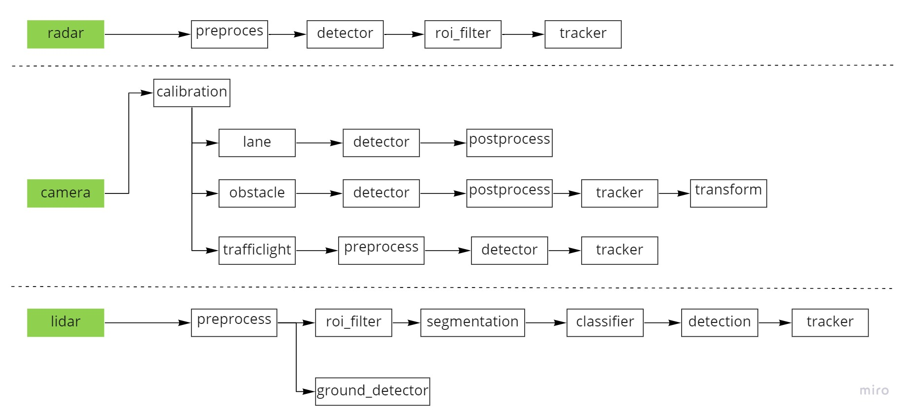

# Dig into Apollo - Perception 

> 温故而知新，可以为师矣


## Table of Contents
- [CNN](cnn)
    - [什么是CNN？](cnn#what_is_cnn)
    - [CNN的原理](cnn#cnn_principle)
        - [卷积层(Convolutional Layer)](cnn#convolutional)
        - [池化层(Max Pooling Layer)](cnn#max_pool)
        - [全连接层(Fully Connected Layer)](cnn#fully_connect)
    - [如何构建CNN](cnn#how_to)
    - [基本概念](cnn#base_concept)
    - [引用](cnn#reference)
- [Caffe2](caffe2)
    - [Caffe2环境准备](caffe2#env)
    - [安装显卡驱动](caffe2#drivers)
    - [安装CUDA](caffe2#cuda)
        - [选择CUDA版本](caffe2#cuda_version)
        - [安装CUDA](caffe2#cuda_install)
        - [设置环境变量](caffe2#cuda_env)
        - [检验安装](caffe2#cuda_check)
    - [安装cuDNN](caffe2#cudnn)
    - [安装Caffe2](caffe2#caffe2)
    - [参考](caffe2#reference)
- [Perception模块简介](#introduction)
    - [production目录](#production)
    - [onboard目录](#onboard)
    - [radar子模块](#radar_module)
    - [camera子模块](#camera_module)
    - [lidar子模块](#lidar_module)
    - [fusion子模块](#fusion_module)
    - [inference推理子模块](#inference_module)
    - [Reference](#reference)

<a name="introduction" />

## Perception模块简介

首先简单看下perception的目录结构：  
```
.
├── BUILD
├── Perception_README_3_5.md
├── README.md
├── base           // 基础类
├── camera         // 相机相关            --- 子模块流程
├── common         // 公共目录
├── data           // 相机的内参和外参
├── fusion         // 传感器融合
├── inference      // 深度学习推理模块
├── lib            // 一些基础的库，包括线程、时间等
├── lidar          // 激光雷达相关         --- 子模块流程
├── map            // 地图
├── model          // 深度学习模型
├── onboard        // 各个子模块的入口     --- 子模块入口
├── production     // 感知模块入口（深度学习模型也存放在这里）--- 通过cyber启动子模块
├── proto          // 数据格式，protobuf
├── radar          // 毫米波               --- 子模块流程
├── testdata       // 上述几个模块的测试数据
└── tool           // 离线测试工具
```
下面介绍几个重要的目录结构: 
* production目录 - **感知模块的入口在production目录，通过lanuch加载对应的dag，启动感知模块**，感知模块包括多个子模块，在onboard目录中定义。  
* onboard目录 - 定义了多个子模块，分别用来处理不同的传感器信息（Lidar,Radar,Camera）。各个子模块的入口在onboard目录中，每个传感器的流程大概相似，可以分为预处理，物体识别，感兴趣区域过滤以及追踪。
* inference目录 - 深度学习推理模块，我们知道深度学习模型训练好了之后需要部署，而推理则是深度学习部署的过程，实际上部署的过程会对模型做加速，**主要实现了caffe，TensorRT和paddlepaddle**3种模型部署。训练好的深度模型放在"modules\perception\production\data"目录中，然后通过推理模块进行加载部署和在线计算。  
* camera目录 - 主要实现车道线识别，红绿灯检测，以及障碍物识别和追踪。  
* radar目录 - 主要实现障碍物识别和追踪（由于毫米波雷达上报的就是障碍物信息，这里主要是对障碍物做追踪）。  
* lidar目录 - 主要实现障碍物识别和追踪（对点云做分割，分类，识别等）。  
* fusion目录 - 对上述传感器的感知结果做融合。  

整个模块的流程如图：  
  
可以看到感知模块由production模块开始，由fusion模块结束。  


<a name="production" />

## production目录
production中主要是存放：  
1. 配置和lanuch和dag启动文件  
2. 存放训练好的模型  
```
.
├── conf  // 配置文件
├── dag   // dag启动文件
├── data  // 训练好的模型
└── launch // cyber launch加载dag
```
该文件中有多个lanuch文件，同时一个lanuch文件中包含多个dag文件，也就是说一个lanuch文件会启动多个子模块。


<a name="onboard" />

## onboard目录
onboard目录定义了多个子模块，每个子模块对应一个功能，包括：车道线识别，障碍物识别，红绿灯识别，传感器融合，场景分割等。  
```
.
├── common_flags
├── component          // 子模块入口
├── inner_component_messages
├── msg_buffer
├── msg_serializer
├── proto
└── transform_wrapper
```

实际上几个子模块可能合并为一个模块，如何确定模块是否合并呢？我们可以查看"onboard/component"目录中的BUILD文件。
```
    name = "perception_component_inner_lidar",
    srcs = [
        "fusion_component.cc",
        "lidar_output_component.cc",
        "radar_detection_component.cc",
        "recognition_component.cc",
        "segmentation_component.cc",
        "detection_component.cc",
    ],
```
在BUILD文件中上述几个模块被编译为一个模块"libperception_component_lidar"。也就是说在dag中实际上只需要启动**libperception_component_lidar**这一个模块就相当于启动了上述几个模块。  


看完了perception模块的入口，以及各个子模块的定义，那么各个子模块的功能如何实现的呢？  实际上感知各个子模块的功能是通过lidar,radar和camera3种传感器实现的，每种传感器分别都执行了目标识别和追踪的任务，最后通过fusion对传感器的数据做融合，执行代码分别在"perception/radar","perception/lidar","perception/camera"目录中。这里有2种查看代码的方式，一种是正序的方式，根据具体的功能，例如从物体识别子模块入手，分别查看lidar,radar和camera模块中的物体识别功能，另一种是倒序的方式，根据传感器划分，先查看传感器分别实现了哪些功能，然后回过头来看各个子模块是如何把上述功能整合起来的。这里我们采用第2种方式，先看各个传感器的执行流程如下图。  
  
从图中可以看到，每个传感器都实现了物体识别的功能，而摄像头还实现了车道线识别和红绿灯检测的功能，每个传感器执行的任务流水线也大概相似，先进行预处理，然后做识别，最后过滤并且追踪目标。其中物体识别用到了推理引擎inference。  

接下来来我们分别查看各个传感器的具体实现。我们先从radar开始看起，主要是radar模块相对比较简单。  


<a name="radar_module" />

## radar子模块
[radar子模块介绍](radar#radar)


<a name="camera_module" />

## camera子模块
[radar子模块介绍](camera#radar)


<a name="reference" />

## Reference
[A Beginner's Guide to Convolutional Neural Networks](https://skymind.ai/wiki/convolutional-network)  
[cnn](https://cs231n.github.io/convolutional-networks/)  
[traffic light dataset](https://hci.iwr.uni-heidelberg.de/node/6132/download/3d66608cfb112934ef40175e9a20c81f)  
[pytorch-tutorial](https://github.com/yunjey/pytorch-tutorial)  
[全连接层的作用是什么？](https://www.zhihu.com/question/41037974)  
[索伯算子](https://zh.wikipedia.org/wiki/%E7%B4%A2%E8%B2%9D%E7%88%BE%E7%AE%97%E5%AD%90)  
[卷积](https://zh.wikipedia.org/wiki/%E5%8D%B7%E7%A7%AF)  
[TensorRT(1)-介绍-使用-安装](https://arleyzhang.github.io/articles/7f4b25ce/)   
[高性能深度学习支持引擎实战——TensorRT](https://zhuanlan.zhihu.com/p/35657027)  

