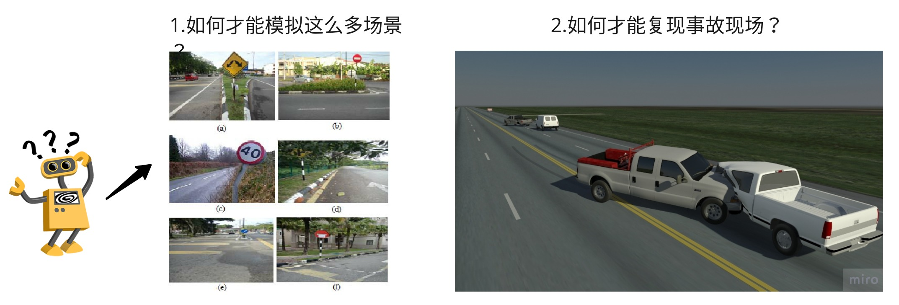

# Dig into Apollo - Simulation 

> 古之学者必有师。师者，所以传道受业解惑也。

## 目录
- [为什么需要仿真](#why_simulation)
- [如何仿真](#how_simulation)
    - [仿真软件](#simulator)
    - [工作方式](#simulator_work)
    - [工作原理](#simulator_principle)
- [如何使用](#how_to)
    - [桥接器](#adapter)
    - [制作地图](#make_map)
    - [测试场景](#test_case)
    - [功能多样化](#features)
- [参考](#reference)

<a name="why_simulation" />

## 为什么需要仿真
  
1. 想象一下当你发现了一个新的算法，但还不确认它是否有效，你是否会直接找一辆自动驾驶汽车，更新软件，并且进行测试呢？这样做可能并不安全，你必须把所有的场景测试一遍以保证它足够好，这可需要大量的时间。仿真的好处显而易见，**它通过软件模拟来发现和复现问题，而不需要真实的环境和硬件，可以极大的节省成本和时间**。  
2. 随着现在深度学习的兴起，仿真在自动驾驶领域有了新的用武之地。**自动驾驶平台通过仿真采集数据，可以把训练时间大大提高，远远超出路测的时间，加快模型迭代速度**。先利用集群训练模型，然后再到实际的路测中去检验，采用数据驱动的方式来进行自动驾驶研究。  

自动驾驶的仿真的论文可以参考英伟达的[End to End Learning for Self-Driving Cars](https://arxiv.org/abs/1604.07316)，主要的目的是通过软件来模拟车以及车所在的环境，实现自动驾驶的集成测试，训练模型，模拟事发现场等功能。那么我们是如何模拟车所在的环境的呢？  

<a name="how_simulation" />

## 如何仿真
**要模拟车所在的环境，就得把真实世界投影到虚拟世界，并且需要构造真实世界的物理规律**。例如需要模拟真实世界的房子，车，树木，道路，红绿灯，不仅需要大小一致，还需要能够模拟真实世界的物理规律，比如树和云层会遮挡住阳光，房子或者障碍物会阻挡你的前进，车启动和停止的时候会有加减速曲线。  
**总之，这个虚拟世界得满足真实世界的物理规律才足够真实，模拟才足够好**。而这些场景恰恰和游戏很像，游戏就是模拟真实世界，并且展示出来，游戏做的越好，模拟的也就越真实。实现这一切的就是游戏引擎，通过游戏引擎模拟自然界的各种物理规律，可以让游戏世界和真实世界差不多。这也是越来越多的人沉迷游戏的原因，因为有的时候根本分不清是真实世界还是游戏世界。  
现在我们找到了一条捷径，用游戏来模拟自动驾驶，这看起来是一条可行的路，我们把自动驾驶中的场景复制到游戏世界，然后模拟自动驾驶中各种传感器采集游戏世界中的数据，看起来我们就像是在真实世界中开着自动驾驶汽车在测试了。  

<a name="simulator" />

#### 仿真软件
我们已经知道可以用游戏来模拟自动驾驶，而现在大家也都是这么做的，目前主流的仿真软件都是根据游戏引擎来开发，下面是主要的几个仿真软件：  

| 仿真软件                                                   | 引擎    | 介绍                              |
|------------------------------------------------------------|---------|-----------------------------------|
| [Udacity](https://github.com/udacity/self-driving-car-sim) | Unity   | 优达学城的自动驾驶仿真平台        |
| [Carla](https://github.com/carla-simulator/carla)          | Unreal4 | Intel和丰田合作的自动驾驶仿真平台 |
| [AirSim](https://github.com/Microsoft/AirSim)              | Unreal4 | 微软的仿真平台，还可以用于无人机  |
| [lgsvl](https://github.com/lgsvl/simulator)                | Unity   | LG的自动驾驶仿真平台              |
| [Apollo](https://github.com/ApolloAuto/apollo)             |         | Dreamview百度的自动驾驶仿真平台   |

* **Unreal4** - 主要的编程方式是c++，源码完全开源，还可以通过蓝图来编程。比较著名的游戏有：《鬼泣5》《绝地求生：刺激战场》
* **Unity**   - 主要的编程方式是c#和脚本，源码不开放，超过盈利上限收费。比较著名的游戏有：《王者荣耀》《炉石传说》

<a name="simulator_work" />

#### 工作方式
那么仿真软件是如何工作的呢？大部分的仿真软件分为2部分：server端和client端。  
* server端主要就是游戏引擎，提供模拟真实世界的传感器数据，并且提供控制车辆，红绿灯以及行人的接口，还提供一些辅助接口，例如改变天气状况，检测车辆是否有碰撞等。
* client端则根据server端返回的传感器数据进行具体的控制，调整参数等。  

可以认为server就是游戏机，而client则是游戏手柄，根据游戏中的情况，选择适当的控制方式，直到游戏通关。  

<a name="simulator_principle" />

#### 工作原理
我们知道游戏引擎模拟了传感器的数据，那么游戏引擎是如何实现模拟真实世界中的传感器数据的呢？  
* 摄像头深度信息
* 摄像头场景分割
* 摄像头长短焦
* Lidar点云
* radar毫米波
* Gps信息

除了传感器数据，还需要模拟真实世界的物理规律：  
* 碰撞检测
* 光线和天气变化
* 汽车动力学模型

> TODO: 补充原理

<a name="how_to" />

## 如何使用

<a name="adapter" />

#### 桥接器
如果是单独实现或者测试一个算法，直接拿写好的算法在仿真软件上进行测试就可以了，但是如果是需要测试已经开发好的软件，比如apollo和autoware系统，则需要实现仿真软件和自动驾驶系统的对接。一个简单的想法就是增加一个桥接器，就像手机充电器的转换头一样，通过桥接器来连接仿真软件和自动驾驶系统。目前carla和lgsvl都实现了通过桥接器和自动驾驶系统的对接，可以直接通过仿真软件来测试自动驾驶系统。  

> 目前carla和lgsvl都是单独把apollo和autoware拉了一个分支，然后在其中集成一个适配器(ROS桥接)，来实现仿真软件和自动驾驶系统的对接。当然apollo3.5切换到cyber框架之后，可以通过cyber桥接来实现。

<a name="make_map" />

#### 制作地图
仿真中另外一个问题经常遇到的问题就是制作地图，以上的仿真软件都提供了地图编辑器来构建自己想要测试的地图。目前地图格式主要采用的是OpenDrive格式的地图，如果是和Apollo集成的化，需要把OpenDrive格式的地图转换为Apollo中能够使用的地图格式。现在的主要问题是地图编辑器不是那么好用，大部分好用的地图编辑软件都需要收费。  

<a name="test_case" />

#### 测试场景
根据我们的测试需求，我们可以构建以下几种测试场景：  
  
* **场景复现** - 假如自动驾驶过程中出现了一次接管（自动驾驶遇到突发状况解决不了，被人类驾驶员接管），首先我们需要复现当时的场景，这时候不可能再重新回去构建相同的场景，这时候就需要仿真去模拟当时的场景，找到问题之后，我们也可以通过仿真来看针对上述接管的情况是否解决。仿真通过模拟当时接管的场景，可以复现当时出现的问题，同时判断修改软件之后是否对当时的场景有所改善。  
* **集成测试** - 每次开发一个新的功能和迭代之后，通过仿真构造全部场景的测试用例，例如:红绿灯，超车，停车，左拐弯，右拐弯，掉头，十字路口等情况来测试所有场景是否都没有问题，可以在软件真正上车测试之前保证软件的可靠性，检验新开发的功能，提高软件质量，减少测试成本。  
* **训练模型** - 通过仿真软件来生成数据训练模型，真实场景的数据采集需要大量的车和时间，而软件可以通过分布式部署就可以实现模拟真实场景的大量数据，特别是针对目前感知的深度学习算法需要大量数据训练的情况，所以通过仿真可以加快模型训练和部署的速度。另外斯坦福大学还通过仿真来模拟汽车失控的情况下，尽量避免碰撞的场景，做一些新的研究和尝试。  

<a name="features" />

#### 功能多样化
我们需要仿真软件能够适应不同的测试场景，就必须要求仿真软件能够提供灵活和多样化的功能，我们要提供哪些功能呢？  
* **多机控制** - 不仅可以控制自己，还可以控制游戏中的其他角色。控制多辆车在一个地图里面跑，好处是可以多辆车竞争，有点类似遗传算法，把一些车放到里面跑，然后其中选出最好的，如此往复，得到最好的模型。同时多机控制还可以帮助我们控制游戏中的其他车辆，构建不同的测试场景，比如：行人横穿马路，超车等情况。  
* **传感器参数调整** - 通过调整传感器参数实现不同硬件配置下的自动驾驶模拟，例如调整摄像头的参数，调整激光雷达的位置等，增加了传感器的灵活性。  
* **汽车模型** - 根据需要导入不同的汽车模型，包括卡车，三轮车，小汽车的3D模型和动力学模型。  
* **地图模型** - 如果纯手工制作模型太难了，是否可以根据3D点云的数据，然后根据软件来虚拟生成道路模型。  

<a name="reference" />

## 参考
[虚幻引擎游戏列表](https://zh.wikipedia.org/wiki/%E8%99%9A%E5%B9%BB%E5%BC%95%E6%93%8E%E6%B8%B8%E6%88%8F%E5%88%97%E8%A1%A8)  
[Unity3D](https://baike.baidu.com/item/Unity3D)  
[Udacity](https://github.com/udacity/self-driving-car-sim)  
[Carla](https://github.com/carla-simulator/carla)  
[AirSim](https://github.com/Microsoft/AirSim)  
[lgsvl](https://github.com/lgsvl/simulator)  
[Apollo](https://github.com/ApolloAuto/apollo)  
